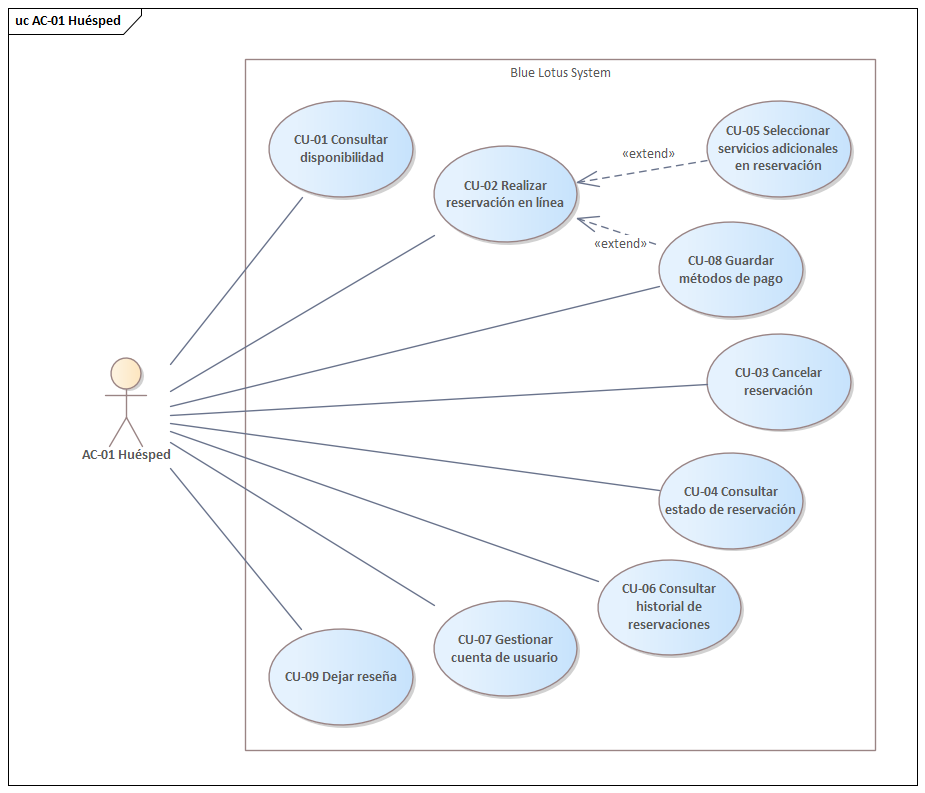

= 2. Definición de Requerimientos

== 2.1 Planteamiento del problema

== 2.2 Alcance y propósito del diseño

== 2.3 Diagrama de casos de uso
.Diagrama de casos de uso del AC-01 Huésped

.Diagrama de casos de uso del AC-02 Recepcionista
image::images/ReceptionistUseCaseDiagram.png[]

.Diagrama de casos de uso del AC-03 Administrador
image::images/AdministratorUseCaseDiagram.png[]

.Diagrama de casos de uso del AC-04 Auditor

== 2.4 Descripciones de casos de uso

