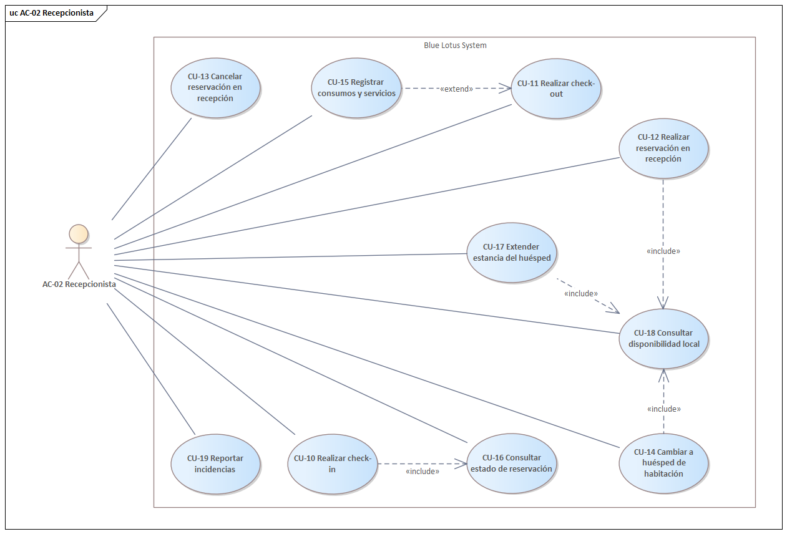
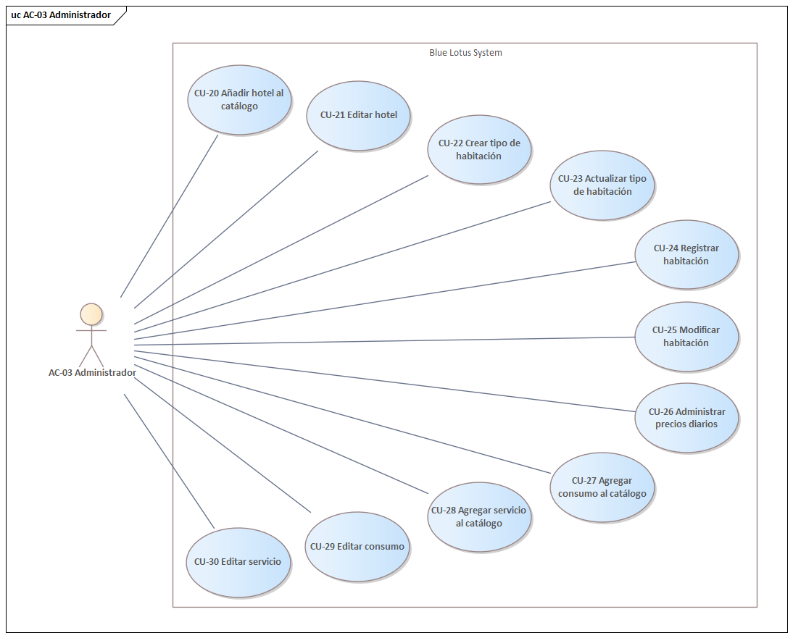

= 2. Definición de Requerimientos
:toc: left
:sectnums:

== Planteamiento del problema

== Alcance y propósito del diseño

== Diagrama de casos de uso
.Diagrama de casos de uso del AC-01 Huésped
image::images/GuestUseCaseDiagram.png[width=600, allign=center]

.Diagrama de casos de uso del AC-02 Recepcionista

.Diagrama de casos de uso del AC-03 Administrador

.Diagrama de casos de uso del AC-04 Auditor
image::images/AuditorUseCaseDiagram.png[width=600, allign=center]

== Descripciones de casos de uso

