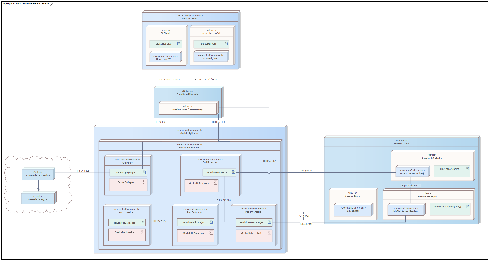

== Vista de despliegue

=== Propósito de la vista
La vista de despliegue del BlueLotus System tiene como objetivo describir la topología física sobre la cual se ejecuta el sistema, detallando cómo los artefactos de software se distribuyen en nodos de cómputo, redes y almacenamiento. A diferencia de las vistas lógicas que tratan sobre la organización del código, esta vista se centra en la infraestructura necesaria para soportar la operación en producción de una cadena con más de 5,000 hoteles.

El propósito fundamental de esta sección es demostrar la viabilidad técnica del sistema para cumplir con los atributos de calidad más exigentes, específicamente aquellos que dependen del hardware y la red, como la Disponibilidad (QAS-03), la Escalabilidad (QAS-10), el Rendimiento (QAS-07) y la Seguridad (QAS-13). Se busca representar claramente los protocolos de comunicación, los límites de red (firewalls, DMZ) y las estrategias de redundancia física.

Esta documentación sirve como la hoja de ruta crítica para los ingenieros de infraestructura y operaciones (DevOps). Al especificar cómo se orquestan los contenedores, cómo se replican las bases de datos y cómo se protege el tráfico de red, se asegura que el entorno de producción sea capaz de tolerar fallos, escalar ante picos de demanda imprevistos y proteger los datos sensibles de los huéspedes, cerrando la brecha entre el diseño arquitectónico abstracto y la realidad operativa.

=== Justificación de las decisiones
En la vista de despliegue se tomaron decisiones de infraestructura orientadas a crear un entorno resiliente y elástico. Cada elección tecnológica, desde el orquestador de contenedores hasta la topología de base de datos, responde a una necesidad crítica del negocio hotelero, priorizando la continuidad operativa y la protección de datos sobre la simplicidad de configuración.

**Drivers**

Las decisiones de infraestructura estuvieron fuertemente impulsadas por los requisitos de volumen y disponibilidad. El driver principal fue la **Escalabilidad y Elasticidad (QAS-10, QAS-12)**. Con una proyección de 300 consultas por segundo (QPS) y picos estacionales drásticos (vacaciones), era inviable depender de una arquitectura de servidores estáticos o monolíticos que desperdiciaran recursos en tiempos de baja demanda o colapsaran en alta. Se requería una infraestructura que pudiera crecer y decrecer dinámicamente.

La **Alta Disponibilidad (QAS-03)** fue otro motor crítico. La restricción de negocio exige un uptime del 95%, lo que implica que el sistema no puede detenerse por fallos en un servidor individual o mantenimiento de base de datos. Esto obligó a diseñar redundancia en cada capa de la infraestructura.

La **Seguridad de Datos en Tránsito (QAS-13)** dictó la estructura de la red. Dado que se manejan transacciones financieras y datos personales, se debía garantizar que ninguna comunicación externa llegara directamente a los servidores de datos o lógica de negocio sin pasar por un filtro de seguridad, y que todo tráfico fuera cifrado.

Finalmente, el **Rendimiento de Lectura (QAS-08)** impulsó la necesidad de separar las cargas de trabajo. Se identificó que las operaciones de consulta (búsqueda de habitaciones) superan masivamente a las de escritura (reservas), por lo que la infraestructura de datos debía optimizarse para lecturas masivas sin bloquear las transacciones de venta.

**Tácticas**

Para satisfacer estos drivers, se aplicaron tácticas de arquitectura física específicas. Se utilizó la táctica de **Asignación de Recursos Dinámica** mediante la contenerización. En lugar de desplegar aplicaciones completas en máquinas virtuales pesadas, se optó por empaquetar servicios individuales en unidades ligeras (contenedores) que pueden iniciarse o detenerse en segundos según la demanda del CPU y memoria.

Se aplicó la táctica de **Redundancia Activa** en la capa de datos. No basta con tener respaldos; se implementó una replicación en tiempo real donde múltiples nodos de base de datos contienen la misma información, permitiendo que si el nodo principal falla, otro pueda tomar su lugar inmediatamente o seguir sirviendo lecturas.

Para la seguridad, se utilizó la táctica de **Segmentación de Red**. Se creó una separación física y lógica entre lo que es público (Internet) y lo que es privado (Datos y Lógica), introduciendo zonas intermedias de seguridad para inspeccionar el tráfico.

Adicionalmente, se empleó la táctica de **Introducir Caché Operativa** a nivel de infraestructura. Se decidió colocar un almacenamiento en memoria de alta velocidad frente a la base de datos relacional para interceptar las consultas repetitivas, reduciendo la latencia de disco y liberando cómputo en el motor de base de datos principal.

**Patrones y Decisiones**

Estas tácticas se materializaron en patrones de despliegue concretos. La decisión central fue adoptar un patrón de **Orquestación de Contenedores con Kubernetes**. Este patrón permite gestionar el ciclo de vida de los servicios de negocio (GestorDeReservas, GestorDeInventario, etc.) como *Pods* efímeros. Kubernetes se encarga automáticamente de balancear la carga entre ellos y reiniciarlos si fallan, cumpliendo con la elasticidad y auto-recuperación.

Para el almacenamiento, se configuró una base de datos MySQL dividida en roles de **Maestro y Esclavo**. El servidor Maestro se dedica exclusivamente a registrar nueva información, garantizando la integridad de las reservas. Mientras tanto, los servidores Esclavos funcionan como copias de lectura para atender las consultas de disponibilidad. Esta división permite manejar un alto volumen de búsquedas sin saturar el proceso de venta.

Se implementó el patrón de **Proxy Inverso / API Gateway**. Se desplegó un balanceador de carga en una zona de red aislada para actuar como único punto de entrada. Este componente gestiona el descifrado de las comunicaciones seguras provenientes de internet y distribuye el tráfico hacia los servicios internos, protegiendo la estructura de la red privada de una exposición directa.

Además, se integró el patrón de **Caché Distribuida** utilizando un clúster de Redis accesible vía TCP. Los servicios consultan este clúster antes de ir a la base de datos, lo que es vital para cumplir con los tiempos de respuesta de milisegundos exigidos en las búsquedas de disponibilidad.

**Trade-offs**

La adopción de esta arquitectura distribuida conlleva ciertos compromisos. La **complejidad operativa** es significativamente mayor que en un despliegue monolítico. Administrar un clúster de Kubernetes, asegurar la sincronización de réplicas de base de datos y gestionar certificados en el balanceador requiere personal altamente especializado y herramientas de monitoreo avanzadas.

Existe un trade-off en la **consistencia de datos**. Al usar replicación maestro-esclavo asíncrona (para no penalizar el rendimiento de escritura), existe una pequeña ventana de tiempo (milisegundos) en la que una réplica puede no tener el último dato escrito en el maestro (*consistencia eventual*). El diseño de la aplicación debe tolerar esto en las búsquedas, aunque se mitiga validando contra el maestro al momento de reservar.

El **costo de infraestructura** inicial es más elevado debido a la necesidad de múltiples nodos (balanceadores, maestros, esclavos, clúster de caché) en lugar de un solo servidor potente. Sin embargo, este costo se justifica plenamente por la prevención de pérdidas millonarias que causaría una caída del sistema en una cadena de 5,000 hoteles.

Finalmente, la **latencia de red** aumenta ligeramente debido a los saltos adicionales (del Load Balancer al Pod, del Pod a la Caché o BD). Se mitiga este impacto utilizando protocolos binarios eficientes como gRPC para la comunicación interna y manteniendo todos los componentes dentro de la misma región de centro de datos.

=== Diagrama de despliegue

La arquitectura de despliegue del BlueLotus System ha sido diseñada para satisfacer los exigentes requisitos de escalabilidad global y alta disponibilidad necesarios para soportar la operación de una cadena hotelera de gran magnitud. Para lograr la escalabilidad y elasticidad requeridas (QAS-10, QAS-12), se decidió desplegar los componentes de software como microservicios contenerizados dentro de un clúster de Kubernetes. Esta estrategia permite que servicios críticos como el `GestorDeInventario` o el `GestorDeReservas` escalen horizontalmente de manera independiente, aumentando automáticamente el número de réplicas (Pods) durante picos de demanda para soportar la carga de 300 consultas por segundo, sin desperdiciar recursos en componentes con menor tráfico.

Para garantizar la alta disponibilidad del 95% estipulada (QAS-03) y la recuperación ante desastres, la infraestructura se apoya en dos pilares fundamentales. Primero, un Balanceador de Carga (Load Balancer) actúa como el único punto de entrada al sistema, distribuyendo el tráfico entre las instancias saludables y eliminando puntos únicos de fallo en la capa de aplicación. Segundo, en la capa de persistencia, se implementó una topología de base de datos Maestro-Esclavo (Master-Replica). El nodo maestro se dedica exclusivamente a las transacciones de escritura críticas para mantener la consistencia, mientras que las réplicas sirven las operaciones de lectura masiva; en caso de fallo del maestro, una réplica puede ser promovida automáticamente, minimizando drásticamente el tiempo fuera de servicio.

La seguridad y la protección de datos sensibles (QAS-13, CRN-03) se gestionan mediante una estricta segmentación de red. El tráfico externo proveniente de internet es cifrado mediante HTTPS (TLS 1.3) y termina en el Balanceador de Carga situado en la DMZ. A partir de ahí, la comunicación interna hacia el clúster de aplicaciones y las bases de datos ocurre dentro de una red privada virtual (VPC) totalmente aislada y sin acceso directo desde el exterior, reduciendo la superficie de ataque. Finalmente, la integración con la Pasarela de Pagos externa se desacopla mediante un componente dedicado que se comunica vía HTTPS, asegurando que la latencia o los fallos en la red externa no bloqueen los recursos críticos del núcleo del sistema.
