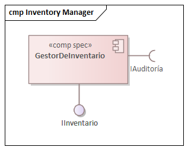
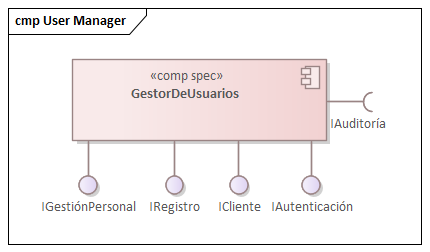

== Vista de implementación

=== Propósito de la vista

=== Justificación de las decisiones

=== Diagramas de Especificación de Componentes
Los diagramas de especificación de componentes se utilizan para describir la estructura y organización de los componentes del sistema. Estos diagramas muestran cómo se dividen las funcionalidades en diferentes componentes y cómo se relacionan entre sí. Se centran en los aspectos técnicos de la implementación, como las interfaces de los componentes, sus dependencias y la forma en que interactúan.

A continuación, se presentan los diagramas de especificación de componentes del sistema:

==== Diagrama de Especificación de Componentes del Módulo de Auditoría
image::../images/AuditModuleComponent.png[width=600,align="center",alt="Diagrama de Especificación de Componentes del Módulo de Auditoría"]

==== Diagrama de Especificación de Componentes del Módulo de Inventario

==== Diagrama de Especificación de Componentes del Módulo de Pagos
image::../images/PaymentManagerComponent.png[width=600,align="center",alt="Diagrama de Especificación de Componentes del Módulo de Pagos"]

==== Diagrama de Especificación de Componentes de la Pasarela de Pagos
image::../images/PaymentServiceComponent.png[width=600,align="center",alt="Diagrama de Especificación de Componentes de la Pasarela de Pagos"]

==== Diagrama de Especificación de Componentes del Módulo de Reportes

==== Diagrama de Especificación de Componentes del Módulo de Reservaciones
image::../images/ReservationManagerComponent.png[width=600,align="center",alt="Diagrama de Especificación de Componentes del Módulo de Reservaciones"]

==== Diagrama de Especificación de Componentes del Módulo de Estancias

==== Diagrama de Especificación de Componentes del Módulo de Usuarios

=== Diagramas de Especificación de Interfaces
Los diagramas de especificación de interfaces se utilizan para definir las interfaces que los componentes del sistema exponen y consumen. Estos diagramas detallan los métodos, atributos y protocolos de comunicación que permiten la interacción entre diferentes componentes. Se centran en cómo los componentes se comunican entre sí a través de sus interfaces, asegurando una integración efectiva y coherente.

A continuación, se presentan los diagramas de especificación de interfaces del sistema:

==== Diagrama de Especificación de Interfaces de IAuditoría
image::../images/IAuditoriaSpecification.bmp[width=600,align="center",alt="Diagrama de Especificación de Interfaces de IAuditoría"]

==== Especificación de las Operaciones de IAuditoría
[cols="^20,<40,<40", options="header"]
|===
| Operación | Precondiciones | Postcondiciones
|===

==== Diagrama de Especificación de Interfaces de IAutenticación
image::../images/IAutenticaciónSpecification.png[width=600,align="center",alt="Diagrama de Especificación de Interfaces de IAutenticación"]

==== Especificación de las Operaciones de IAutenticación
[cols="^20,<40,<40", options="header"]
|===
| Operación | Precondiciones | Postcondiciones
|===

==== Diagrama de Especificación de Interfaces de ICheckIn
image::../images/ICheckInSpecification.bmp[width=600,align="center",alt="Diagrama de Especificación de Interfaces de ICheckIn"]

==== Especificación de las Operaciones de ICheckIn
[cols="^20,<40,<40", options="header"]
|===
| Operación | Precondiciones | Postcondiciones
|===

==== Diagrama de Especificación de Interfaces ICheckOut
image::../images/ICheckOutSpecification.png[width=600,align="center",alt="Diagrama de Especificación de Interfaces ICheckOut"]

==== Especificación de las Operaciones de ICheckOut
[cols="^20,<40,<40", options="header"]
|===
| Operación | Precondiciones | Postcondiciones
|===

==== Diagrama de Especificación de Interfaces IConsultaDisponibilidad

==== Especificación de las Operaciones de IConsultaDisponibilidad
[cols="^20,<40,<40", options="header"]
|===
| Operación | Precondiciones | Postcondiciones
|===

==== Diagrama de Especificación de Interfaces IGestionEstancias

==== Especificación de las Operaciones de IGestionEstancias
[cols="^20,<40,<40", options="header"]
|===
| Operación | Precondiciones | Postcondiciones
|===

==== Diagrama de Especificación de Interfaces IInventario
image::../images/IInventarioSpecification.png[width=600,align="center",alt="Diagrama de Especificación de Interfaces IInventario"]

==== Especificación de las Operaciones de IInventario
[cols="^20,<40,<40", options="header"]
|===
| Operación | Precondiciones | Postcondiciones
|===

==== Diagrama de Especificación de Interfaces IPago
image::../images/IPagoSpecification.png[width=600,align="center",alt="Diagrama de Especificación de Interfaces IPago"]

==== Especificación de las Operaciones de IPago
[cols="^20,<40,<40", options="header"]
|===
| Operación | Precondiciones | Postcondiciones
|===

==== Diagrama de Especificación de Interfaces IPasarelaPago
image::../images/IPasarelaPagoSpecification.bmp[width=600,align="center",alt="Diagrama de Especificación de Interfaces IPasarelaPago"]

==== Especificación de las Operaciones de IPasarelaPago
[cols="^20,<40,<40", options="header"]
|===
| Operación | Precondiciones | Postcondiciones
|===

==== Diagrama de Especificación de Interfaces IRegistro
image::../images/IRegistroSpecification.png[width=600,align="center",alt="Diagrama de Especificación de Interfaces IRegistro"]

==== Especificación de las Operaciones de IRegistro
[cols="^20,<40,<40", options="header"]
|===
| Operación | Precondiciones | Postcondiciones
|===

==== Diagrama de Especificación de Interfaces IReporteAuditoría
image::../images/IReporteAuditoríaSpecification.png[width=600,align="center",alt="Diagrama de Especificación de Interfaces IReporteAuditoría"]

==== Especificación de las Operaciones de IReporteAuditoría
[cols="^20,<40,<40", options="header"]
|===
| Operación | Precondiciones | Postcondiciones
|===

==== Diagrama de Especificación de Interfaces IReporteFinanciero

==== Especificación de las Operaciones de IReporteFinanciero
[cols="^20,<40,<40", options="header"]
|===
| Operación | Precondiciones | Postcondiciones
|===

==== Diagrama de Especificación de Interfaces IReservación
image::../images/IReservaciónSpecification.png[width=600,align="center",alt="Diagrama de Especificación de Interfaces IReservación"]

==== Especificación de las Operaciones de IReservación
[cols="^20,<40,<40", options="header"]
|===
| Operación | Precondiciones | Postcondiciones
|===

=== Interacción de Componentes

