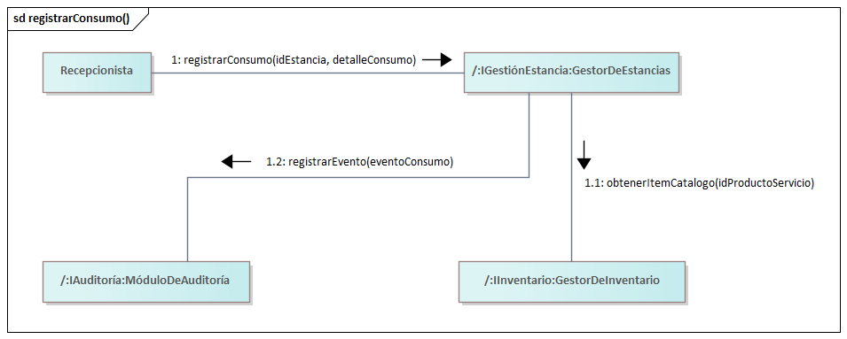

== Vista de implementación

=== Propósito de la vista
La vista de implementación del BlueLotus System tiene como objetivo mostrar cómo se materializa la arquitectura  en una estructura técnica real. Explica cómo las partes del sistema —sus componentes, módulos e interfaces— están organizadas en el entorno de desarrollo y cómo cada una cumple su papel dentro de la solución. Esta vista busca representar la manera en que la arquitectura se traduce a elementos concretos de software, definiendo las relaciones de dependencia, los límites entre módulos y las responsabilidades que cada uno asume. Además, esta vista ayuda a identificar las decisiones técnicas tomadas durante la implementación, los patrones de diseño aplicados y los trade-offs asumidos para cumplir con los requisitos funcionales y no funcionales del sistema.
Se espera que esta vista sirva como guía para los desarrolladores, facilitando la comprensión del código y promoviendo buenas prácticas de desarrollo. Al detallar cómo se estructuran los componentes y cómo interactúan entre sí, se busca asegurar que el sistema sea mantenible, escalable y adaptable a futuros cambios. En resumen, la vista de implementación es una representación técnica que conecta la arquitectura lógica con la realidad del código, proporcionando una base sólida para el desarrollo y evolución del BlueLotus System.

=== Justificación de las decisiones

En la vista de implementación se tomaron diferentes decisiones que buscaban reflejar de forma clara y coherente la arquitectura planteada en el diseño. Esta vista no solo muestra cómo se organiza el código, sino también cómo las decisiones técnicas se relacionan con los objetivos del sistema. Todo lo que se construyó en esta etapa se basó en lo establecido en la documentación, donde se definen las interfaces, los módulos, las operaciones y la forma en que cada parte se comunica con las demás. De esta manera, la implementación no fue improvisada, sino una traducción directa de la arquitectura lógica hacia una estructura técnica real, enfocada en cumplir los requerimientos funcionales y los atributos de calidad que guían el proyecto.

**Drivers**

Las decisiones tomadas durante la implementación estuvieron impulsadas por diferentes factores técnicos y funcionales. Uno de los principales fue la necesidad de mantener una arquitectura modular y escalable, capaz de soportar las operaciones esenciales del dominio hotelero. El sistema debía dividirse en componentes independientes que pudieran trabajar de forma coordinada, pero sin depender directamente unos de otros. Esto no solo facilita el mantenimiento, sino que también permite que varios desarrolladores colaboren sin generar conflictos en el código. Por eso, desde el inicio se buscó que cada módulo tuviera un propósito definido y un conjunto de responsabilidades bien delimitadas.

Otro driver importante fue la mantenibilidad, ya que el sistema no se consideró como un producto terminado, sino como una base que crecerá con el tiempo. Se decidió implementar el proyecto con una estructura que permitiera agregar nuevas funcionalidades sin afectar las existentes. Para lograrlo, se usaron contratos estables en forma de interfaces, lo que permite modificar implementaciones internas sin alterar las dependencias externas. Esto ayuda a que, si en el futuro cambia la forma en que se manejan los pagos o las reservas, el resto de los módulos continúe funcionando correctamente, siempre y cuando se mantengan las firmas de las operaciones.

La seguridad también fue un factor determinante. El sistema gestiona información sensible, como datos personales de los huéspedes y detalles de pago, por lo que se tomaron decisiones orientadas a proteger esa información. Se establecieron límites claros entre módulos, de modo que solo se comuniquen mediante las operaciones autorizadas y definidas. Esto reduce los riesgos de exposición de datos y mantiene un control estricto sobre qué partes del sistema tienen acceso a cierta información. Además, la separación de responsabilidades contribuye a que, si ocurre un fallo en una parte del sistema, no se vea comprometido el resto.

Además, se tomó en cuenta el rendimiento. Aunque el proyecto prioriza la claridad y mantenibilidad, también se buscó que la ejecución fuera eficiente y que las operaciones más utilizadas respondieran con rapidez. Por eso se optó por distribuir la carga entre diferentes componentes en lugar de concentrar toda la lógica en uno solo. Este enfoque permite que el sistema maneje múltiples peticiones al mismo tiempo y que los recursos se usen de manera más equilibrada. En los procesos que requieren comunicación externa, como los pagos, se consideró la posibilidad de manejar respuestas asíncronas o colas de procesamiento para evitar bloqueos.

Otro driver que influyó en la implementación fue la trazabilidad. Desde el punto de vista operativo y de auditoría, era necesario poder seguir cada acción dentro del sistema, saber quién la ejecutó, cuándo ocurrió y con qué resultados. Por eso, se decidió incluir mecanismos de registro y monitoreo en las operaciones críticas, de manera que sea posible rastrear eventos y facilitar el mantenimiento y la detección de errores. Esto también se alinea con los objetivos de calidad y transparencia del sistema.

Finalmente, se consideró la interoperabilidad, especialmente en lo referente a la comunicación con servicios externos. Dado que algunos procesos dependen de terceros, como la pasarela de pago, era importante implementar una arquitectura que permita reemplazar o actualizar esas integraciones sin alterar el funcionamiento interno del sistema. Este driver promovió la idea de encapsular las conexiones externas y tratarlas como puntos de extensión controlados.

**Tácticas**

Para atender estos impulsores, se aplicaron distintas tácticas que permitieron mantener orden, claridad y coherencia en la implementación. Una de ellas fue la separación por capas, que divide el sistema en tres niveles principales: presentación, aplicación y datos o integración. Este enfoque evita mezclar responsabilidades y mantiene el control sobre las dependencias. En la capa de presentación se manejan las interacciones con los usuarios o actores del sistema; en la de aplicación se orquesta la lógica de negocio; y en la de datos se gestionan los accesos a fuentes externas o almacenamiento. Esta separación facilita que cada parte evolucione de forma independiente y permite localizar errores más rápido.

El encapsulamiento también es una táctica importante. Cada módulo oculta su lógica interna y expone únicamente lo que necesita ser accesible a otros componentes. Esto evita que los detalles de implementación se propaguen por el sistema y mantiene la coherencia de los datos. Por ejemplo, los módulos que gestionan pagos, reservas o estancias solo exponen operaciones definidas en sus interfaces, sin mostrar cómo internamente procesan la información. Este tipo de encapsulamiento protege el sistema ante cambios futuros y reduce la posibilidad de errores por modificaciones externas.

También se aplicó la distribución de responsabilidades, una táctica que busca evitar que un solo componente se vuelva demasiado complejo o difícil de mantener. En lugar de crear servicios que hagan todo, se diseñaron componentes que colaboran entre sí, cada uno encargado de una parte específica del proceso. Esto se ve, por ejemplo, en el flujo de pagos, donde el componente principal gestiona la solicitud del pago y la pasarela externa se encarga de la autorización. De esta manera, si una parte del proceso falla, solo se afecta esa parte y no el sistema completo.

La definición formal de interfaces también fue una táctica clave. En lugar de permitir conexiones directas entre módulos, todas las interacciones se realizan mediante contratos bien definidos. Esto da claridad y uniformidad, y garantiza que cada parte cumpla con su responsabilidad. Además, las interfaces facilitan la colaboración entre distintos desarrolladores, ya que pueden trabajar en diferentes módulos sin necesidad de conocer los detalles de implementación del otro.

También el desacoplamiento de dependencias, aplicando principios de inversión de dependencias y la inyección de componentes. En vez de crear instancias directamente dentro del código, las dependencias se inyectan desde el exterior, lo que permite reemplazar o cambiar implementaciones sin alterar el flujo general. Este enfoque es útil cuando se desea probar componentes de forma aislada o cuando se necesita cambiar un servicio externo sin modificar la lógica interna.

Por último, se utilizó la observabilidad del sistema, integrando puntos de registro y monitoreo en operaciones críticas. Esto hace posible entender el comportamiento del sistema en tiempo real, detectar anomalías y tomar decisiones informadas para mejorar su rendimiento o estabilidad. La observabilidad también facilita las pruebas y la depuración, ya que se puede rastrear el origen de un error con mayor precisión.

**Patrones y Decisiones**

Todas estas tácticas se concretaron a través de patrones de diseño y decisiones específicas que guiaron la implementación. Uno de los más evidentes fue el Service Layer, que organiza las funcionalidades principales en servicios con una responsabilidad bien definida. Este patrón ayuda a centralizar la lógica de negocio, separándola de las capas de presentación y de datos. Así, las reglas del negocio se mantienen en un solo lugar y no se repiten en distintas partes del sistema, lo que mejora la consistencia y facilita el mantenimiento.

Otro patrón aplicado fue el Facade, especialmente útil en módulos complejos que agrupan varios procesos internos. En lugar de que el cliente o la capa superior tenga que coordinar varias operaciones, se expone un solo punto de acceso que se encarga de orquestarlas. Este patrón se puede ver, por ejemplo, en los flujos de pagos y reservaciones, donde un método de alto nivel se encarga de manejar los pasos necesarios sin que el usuario conozca los detalles.

También se utilizó el Adapter, que permite conectar el sistema con servicios o componentes externos sin depender directamente de ellos. Esta decisión fue esencial para los módulos que se comunican con proveedores de pago o servicios de terceros. Al usar adaptadores, se puede cambiar o actualizar un servicio externo sin que el resto del sistema deba modificarse, ya que la interfaz de comunicación se mantiene estable.

El principio de Dependency Inversion se aplicó para asegurar que los módulos de mayor nivel dependan de abstracciones y no de implementaciones concretas. Esto hace que la arquitectura sea más flexible y que los cambios en una parte no rompan el sistema. Además, se combinó con Dependency Injection para facilitar las pruebas, permitiendo inyectar versiones simuladas de los componentes cuando es necesario probar comportamientos específicos.

En la organización del código se adoptó una estructura modular por dominio, donde cada área del sistema (como autenticación, pagos o reservas) tiene su propio espacio con sus clases, interfaces y servicios relacionados. Esto hace que el proyecto sea más ordenado y que cualquier persona pueda entender rápidamente dónde se encuentra cada funcionalidad. Además, se establecieron convenciones de nombres y carpetas para mantener la coherencia entre los módulos.

Otra decisión importante fue la inclusión de auditoría y registro de operaciones. Esto se consideró esencial para los procesos críticos del sistema, como la gestión de pagos o la creación de reservaciones. Al registrar los eventos y sus resultados, se puede reconstruir lo que ocurrió en caso de un error o inconsistencia, y se cumple con los requerimientos de trazabilidad y control del proyecto.

**Trade-offs**

Cada decisión tomada durante la implementación implicó ciertos compromisos. Diseñar una arquitectura modular y desacoplada genera una mayor complejidad inicial, ya que requiere más planificación, más clases y una coordinación más precisa entre módulos. Sin embargo, este esfuerzo inicial se traduce en beneficios a largo plazo, ya que el sistema se vuelve más estable y fácil de mantener.

Otro compromiso es el aumento en el número de llamadas entre componentes. Al dividir las responsabilidades, los procesos se vuelven más distribuidos, lo que puede agregar una pequeña sobrecarga en tiempo de ejecución. A pesar de esto, los beneficios en claridad, control y mantenibilidad superan la pérdida mínima de rendimiento.

También se asumió una mayor carga documental, ya que la definición de interfaces y contratos exige mantener la documentación actualizada. Aunque esto implica más trabajo, permite que el sistema sea comprensible para cualquier integrante nuevo del equipo y facilita las auditorías y revisiones.

Además, la integración con servicios externos introduce el riesgo de dependencias fuera del control del sistema, como caídas o lentitud de un proveedor. Este riesgo se mitiga con el uso de adaptadores y manejo de errores controlado, pero no puede eliminarse completamente. Aun así, el beneficio de delegar en servicios especializados, como las pasarelas de pago, compensa ese riesgo.

Otro trade-off fue la curva de aprendizaje para nuevos desarrolladores. Entender la estructura modular, los contratos y las convenciones toma tiempo, pero una vez familiarizados, trabajar en el sistema se vuelve más rápido y seguro. Por último, el diseño orientado a la observabilidad y auditoría genera un consumo adicional de recursos para almacenar y procesar los registros, aunque este costo se justifica por la mejora en la capacidad de monitoreo y la facilidad para resolver problemas.

En general, los trade-offs asumidos no representan desventajas graves, sino decisiones conscientes que priorizan la calidad y sostenibilidad del sistema. Las elecciones hechas en esta vista permiten mantener el equilibrio entre rendimiento, flexibilidad y seguridad, garantizando que el sistema pueda seguir creciendo sin perder estabilidad.

=== Diagramas de Especificación de Componentes
Los diagramas de especificación de componentes se utilizan para describir la estructura y organización de los componentes del sistema. Estos diagramas muestran cómo se dividen las funcionalidades en diferentes componentes y cómo se relacionan entre sí. Se centran en los aspectos técnicos de la implementación, como las interfaces de los componentes, sus dependencias y la forma en que interactúan.

A continuación, se presentan los diagramas de especificación de componentes del sistema:

==== Diagrama de Especificación de Componentes del Módulo de Auditoría
image::../images/AuditModuleComponent.png[width=600,align="center",alt="Diagrama de Especificación de Componentes del Módulo de Auditoría"]

==== Diagrama de Especificación de Componentes del Módulo de Inventario
image::../images/InventoryManagerComponent.png[width=600,align="center",alt="Diagrama de Especificación de Componentes del Módulo de Inventario"]

==== Diagrama de Especificación de Componentes del Módulo de Pagos

==== Diagrama de Especificación de Componentes de la Pasarela de Pagos

==== Diagrama de Especificación de Componentes del Módulo de Reportes
image::../images/ReportManagerComponent.png[width=600,align="center",alt="Diagrama de Especificación de Componentes del Módulo de Reportes"]

==== Diagrama de Especificación de Componentes del Módulo de Reservaciones
image::../images/ReservationManagerComponent.png[width=600,align="center",alt="Diagrama de Especificación de Componentes del Módulo de Reservaciones"]

==== Diagrama de Especificación de Componentes del Módulo de Estancias
image::../images/StaysManagerComponent.png[width=600,align="center",alt="Diagrama de Especificación de Componentes del Módulo de Estancias"]

==== Diagrama de Especificación de Componentes del Módulo de Usuarios
image::../images/UserManagerComponent.png[width=600,align="center",alt="Diagrama de Especificación de Componentes del Módulo de Usuarios"]

==== Diagrama de Especificación de Componentes del Módulo de Catálogo

=== Diagramas de Especificación de Interfaces
Los diagramas de especificación de interfaces se utilizan para definir las interfaces que los componentes del sistema exponen y consumen. Estos diagramas detallan los métodos, atributos y protocolos de comunicación que permiten la interacción entre diferentes componentes. Se centran en cómo los componentes se comunican entre sí a través de sus interfaces, asegurando una integración efectiva y coherente.

A continuación, se presentan los diagramas de especificación de interfaces del sistema:

==== Diagrama de Especificación de Interfaces de IAuditoría
image::../images/IAuditoriaSpecification.png[width=600,align="center",alt="Diagrama de Especificación de Interfaces de IAuditoría"]

==== Especificación de las Operaciones de IAuditoría
[cols="^20,<40,<40", options="header"]
|===
| Operación | Precondiciones | Postcondiciones

| registrarEvento() |
- Los datos en **evento** son válidos (por ejemplo, **tipoEvento** y **descripcionDetallada** no están vacíos, **origen** está presente). |
- Se ha creado una nueva instancia persistente de **RegistroAuditoriaInfo (nuevoRegistro)**. +
- **nuevoRegistro** se rellena con los datos proporcionados en **evento**. +
- Se genera y asigna un **idEvento** único a **nuevoRegistro.idEvento**. +
- **nuevoRegistro.timestamp** se establece a la fecha/hora actual del servidor de auditoría. +
- El valor de retorno (**ResultadoRegistroEvento**) indica éxito (**exito = true**) y contiene el **idEvento**. +
- Si falla (**exito = false**), indica un problema grave en el subsistema de auditoría (**mensajeError** lo indicaría) y el componente llamador debería tener una estrategia de contingencia (por ejemplo, *log local temporal*).

| consultarLogs() |
- El usuario que invoca la operación tiene los permisos adecuados para consultar logs. +
- Los criterios en **filtro** son válidos (por ejemplo, **fechaInicio ≤ fechaFin** si ambas están presentes). |
- Se retorna una lista (**list<RegistroAuditoriaInfo>**) que contiene todas las entradas del log que coinciden con los criterios especificados en **filtro**. +
- Si no se encuentran coincidencias, se retorna una lista vacía. +
- El estado del sistema (los logs existentes) no cambia.
|===

==== Diagrama de Especificación de Interfaces de IAutenticación
image::../images/IAutenticaciónSpecification.png[width=600,align="center",alt="Diagrama de Especificación de Interfaces de IAutenticación"]

==== Especificación de las Operaciones de IAutenticación
[cols="^20,<40,<40", options="header"]
|===
| Operación | Precondiciones | Postcondiciones
| iniciarSesion() |
- Los datos en credenciales son formalmente válidos
|
**Caso Éxito:** +
- Las credenciales.identificador y credenciales.contrasena coinciden con un usuario registrado y activo en el sistema. +
- El valor de retorno indica éxito (exito = true). +
- El resultado.usuarioInfo contiene los datos del usuario autenticado. +
- Se genera un tokenSesion único y con tiempo de expiracionToken definido, que se incluye en resultado.usuarioInfo. +
- Se registra el intento de inicio de sesión exitoso. +
**Caso Fallo (Credenciales Inválidas):** +
- Las credenciales.identificador y credenciales.contrasena no coinciden con un usuario registrado y activo. +
- El valor de retorn indica fallo (exito = false). +
- El resultado.mensajeError indica "Credenciales inválidas" o un mensaje similar genérico. +
- resultado.usuarioInfo es nulo o indefinido. +
**Caso Fallo (Usuario Inactivo/Bloqueado):** +
- Las credenciales coinciden, pero la cuenta del usuario está inactiva o bloqueada. +
- El valor de retorno indica fallo (exito = false). +
- El resultado.mensajeError indica "Cuenta inactiva" o "Cuenta bloqueada". +
- resultado.usuarioInfo es nulo o indefinido. +
- Se registra el intento de inicio de sesión fallido.
|===

==== Diagrama de Especificación de Interfaces de ICatálogo
image::../images/ICatálogoSpecification.png[width=600,align="center",alt="Diagrama de Especificación de Interfaces de ICatálogo"]

==== Especificación de las Operaciones de ICatálogo
[cols="^20,<40,<40", options="header"]
|===
| Operación | Precondiciones | Postcondiciones
| agregarItemCatálogo() |
- El idHotel existe. +
- Los datos en datosItem son válidos. +
- No existe otro ítem en el catálogo de ese hotel con el mismo nombre.
|
- Se crea una nueva instancia de ItemCatalogoInfo. +
- nuevoItem se rellena con datosItem y se asocia al idHotel. +
- Se genera y asigna un idItem único. +
- El valor de retorno (ResultadoItemCatalogo) indica éxito y contiene el idItem. +
- Si falla, retorna exito = false y mensajeError. +
| modificarItemCatálogo() |
- Existe un ItemCatalogoInfo con el idItem proporcionado. +
- Los datos en datosItem son válidos.
|
- Los atributos de item se actualizan con los valores de datosItem. +
- El valor de retorno (ResultadoOperacion) indica éxito. +
- Si falla, retorna exito = false y mensajeError.
| obtenerItemCatálogo() |
- Existe un ItemCatalogoInfo con el idItem proporcionado.
|
- Se retorna la instancia completa de ItemCatalogoInfo. +
- El estado del sistema no cambia.
| listarItemsCatálogoPorHotel() |
- Existe un HotelInfoCatalogo con el idHotel proporcionado.
|
- Se retorna una lista (list<ItemCatalogoInfo>) con todos los ítems del catálogo asociados al hotel. +
- Si no hay ítems, se retorna una lista vacía. +
- El estado del sistema no cambia.
|===

==== Diagrama de Especificación de Interfaces de ICheckIn
image::../images/ICheckInSpecification.png[width=600,align="center",alt="Diagrama de Especificación de Interfaces de ICheckIn"]

==== Especificación de las Operaciones de ICheckIn
[cols="^20,<40,<40", options="header"]
|===
| Operación | Precondiciones | Postcondiciones
| realizarCheckIn() |
- Existe una ReservacionInfoCheckIn con el idReservacion proporcionado. +
- La fecha actual está dentro del rango permitido para el check-in de la reservación. +
- El estado de la reservación permite el check-in. +
- Existe al menos una HabitacionInfo disponible en el hotel y del tipo especificados en la reservación.
|
- Se identifica o crea una instancia de EstanciaInfo asociada a la reservación. +
- Se selecciona una HabitacionInfo que cumple las condiciones. +
- El estado de la habitación seleccionada se actualiza a 'Ocupada'. +
- La estancia se actualiza o crea con: +
* **estancia.habitacionAsignada = hab** +
* **estancia.fechaCheckIn = fecha/hora actual** +
* **estancia.fechaCheckOutPrevista = res.fechaFin** +
* **estancia.estado = 'Activa'** +
* **estancia.huesped = res.huesped** +
- El estado de la reservación res se actualiza para reflejar que el check-in ocurrió. +
- El valor de retorno (ResultadoCheckIn) indica éxito, contiene el idEstancia y el numeroHabitacionAsignada. +
- Si alguna precondición falla, el valor de retorno indica fallo y mensajeError detalla la causa. El estado del sistema no cambia.
|===

==== Diagrama de Especificación de Interfaces ICheckOut

==== Especificación de las Operaciones de ICheckOut
[cols="^20,<40,<40", options="header"]
|===
| Operación | Precondiciones | Postcondiciones

| realizarCheckOut() |
- Existe una **EstanciaInfoCheckOut (estancia)** con el **idEstancia** proporcionado. +
- El estado de la estancia es **'Activa'** (`estancia.estado = 'Activa'`). +
- La habitación asignada a la estancia (**estancia.habitacionAsignada**) existe y está en estado **'Ocupada'**. |
- Se calcula el **montoTotal** final de la estancia (costo de alojamiento ajustado si es necesario + suma del **costoTotal** de todos los **estancia.consumosRegistrados**). +
- Se actualiza **estancia.saldoPendiente** con el montoTotal (o la parte que faltaba por pagar). +
- Se intenta procesar el **pago de estancia.saldoPendiente** (la interfaz *ICheckOut* solo registra el resultado). +
- Se actualiza **estancia.saldoPendiente** restando el **montoCobrado**. +
- El estado de la estancia se actualiza a **'Finalizada'**. +
- Se registra **fechaCheckOutReal** con la fecha/hora actual. +
- El estado de la habitación asignada se actualiza a **'Disponible'** (o **'Limpieza Pendiente'**). +
- El valor de retorno (**ResultadoCheckOut**) indica éxito (**exito = true**), reporta **montoTotalCobrado** y un mensaje de confirmación. +
- Se notifica al sistema de facturación (**IBilling**) la finalización de la estancia y los cargos finales. +
- Si alguna precondición falla o el pago falla críticamente, el valor de retorno indica fallo (**exito = false**) y **mensajeError** detalla la causa; el estado del sistema intenta mantenerse consistente.

| obtenerDetalleCargosEstancia() |
- Existe una **EstanciaInfoCheckOut (estancia)** con el **idEstancia** proporcionado. +
- La estancia está en estado **'Activa'**. |
- Se calcula el **costoAlojamiento** final. +
- Se recopila la **listaConsumos** de **estancia.consumosRegistrados**. +
- Se calcula **costoTotalConsumos** sumando los costos de la lista. +
- Se calcula **montoTotal = costoAlojamiento + costoTotalConsumos**. +
- Se retorna un objeto **DetalleCargos** con toda esta información. +
- El estado del sistema no cambia y permanece igual que antes de ejecutar la operación.
|===

==== Diagrama de Especificación de Interfaces de ICliente
image::../images/IClienteSpecification.png[width=600,align="center",alt="Diagrama de Especificación de Interfaces de ICliente"]

==== Especificación de las Operaciones de ICliente
[cols="^20,<40,<40", options="header"]
|===
| Operación | Precondiciones | Postcondiciones

| obtenerDatosCliente() |
- Existe un **ClienteInfo (cli)** con el **idCliente** proporcionado. |
- Se retorna la instancia completa de **ClienteInfo (cli)** correspondiente al **idCliente**. +
- El estado del sistema no se modifica; la información de los clientes permanece igual que antes de ejecutar la operación. +
- Si la precondición falla (el cliente no existe), se puede retornar **null** o un objeto **ClienteInfo** vacío/inválido *(esto debería especificarse o manejarse con excepciones según la tecnología utilizada)*.

| actualizarDatosCliente() |
- Existe un **ClienteInfo (cli)** con el **idCliente** proporcionado. +
- Los datos en **nuevosDatos** son válidos (por ejemplo, si incluye **email**, tiene formato correcto; si se actualiza **email**, no debe existir ya en otro cliente). |
- Los atributos del cliente se actualizan con los valores presentes en **nuevosDatos**. +
- Los campos no incluidos en **nuevosDatos** permanecen sin cambios. +
- Si se actualiza el **email**, se valida que no esté en uso por otro cliente; si lo está, la operación falla (**exito = false**). +
- El valor de retorno (**ResultadoActualizacionCliente**) indica éxito (**exito = true**). +
- Si alguna precondición falla (el cliente no existe, los datos son inválidos o el email está duplicado), el valor de retorno indica fallo (**exito = false**) y **mensajeError** detalla la causa. +
- El estado del cliente no cambia; sus datos permanecen iguales que antes de ejecutar la operación.
|===

==== Diagrama de Especificación de Interfaces IConsultaDisponibilidad
image::../images/IConsultaDisponibilidadSpecification.png[width=600,align="center",alt="Diagrama de Especificación de Interfaces IConsultaDisponibilidad"]

==== Especificación de las Operaciones de IConsultaDisponibilidad
[cols="^20,<40,<40", options="header"]
|===
| Operación | Precondiciones | Postcondiciones
| consultarDisponibilidad() |
- Las fechas en consulta son válidas (fechaInicio < fechaFin, fechaInicio >= fecha actual). +
- Si se especifica consulta.idHotel, el hotel debe existir y estar activo. +
- Si se especifica consulta.idTipoHabitacion, este debe existir y pertenecer al idHotel (si se especificó hotel). +
- Si se especifica consulta.numeroHuespedes, este debe ser un entero positivo.
|
- Se retorna una lista (list<DisponibilidadResultado>) que contiene una entrada por cada combinación de HotelInfoConsulta y TipoHabitacionInfoConsulta que cumple con los criterios de la consulta y tiene disponibilidad en al menos una parte del rango consulta.fechaInicio a consulta.fechaFin. +
- Cada DisponibilidadResultado en la lista contiene: +
  * La **información** del hotel y tipo de habitación. +
  * **fechasDisponibles:** Una lista de rangos de fechas dentro del rango consultado donde sí hay disponibilidad. Si hay disponibilidad continua en todo el rango, esta lista contendrá un solo DateRange igual al consultado. +
  * **tarifaPromedioNoche:** El precio promedio por noche calculado para ese tipo de habitación en las fechas consultadas. +
  * **numeroHabitacionesDisponibles:** El número estimado de habitaciones disponibles (puede ser > número físico si hay overbooking). +
- Si consulta.numeroHuespedes fue especificado, solo se incluyen resultados donde TipoHabitacionInfoConsulta.capacidadMaxima >= consulta.numeroHuespedes. +
- Si no se encuentra ninguna disponibilidad que coincida con los criterios, se retorna una lista vacía. +
- El estado del sistema no cambia.
|===

==== Diagrama de Especificación de Interfaces IGestionEstancias
image::../images/IGestionEstanciaSpecification.png[width=600,align="center",alt="Diagrama de Especificación de Interfaces IGestionEstancias"]

==== Especificación de las Operaciones de IGestionEstancias
[cols="^20,<40,<40", options="header"]
|===
| Operación | Precondiciones | Postcondiciones
| cambiarHabitacion() |
- Existe una EstanciaInfoGestion con el idEstancia proporcionado y está 'Activa'. +
- Existe una HabitacionInfoGestion con idNuevaHabitacion en el mismo hotel (estancia.habitacionAsignada.hotel). +
- La nueva habitación está actualmente 'Disponible' (habNueva.estadoActual = 'Disponible'). +
- La habitación actual asignada a la estancia (habActual = estancia.habitacionAsignada) existe y está 'Ocupada'.
|
- El estado de la habitación actual se cambia a 'Disponible' (o 'Limpieza Pendiente'). +
- El estado de la nueva habitación se cambia a 'Ocupada'. +
- La estancia se actualiza para referenciar a la nueva habitación: estancia.habitacionAsignada = habNueva. +
- Se calcula un ajusteCosto si habNueva.tipoHabitacion tiene una tarifa diferente a habActual.tipoHabitacion para las noches restantes. Este ajuste se suma (o resta) a estancia.saldoPendiente. +
- El valor de retorno indica éxito (exito = true), contiene el nuevoNumeroHabitacion (habNueva.numeroHabitacion) y el ajusteCosto calculado. +
- Si alguna precondición falla, el valor de retorno indica fallo (exito = false) y mensajeError explica por qué. El estado del sistema no cambia.
| extenderEstancia() |
- Existe una EstanciaInfoGestion con el idEstancia proporcionado y está 'Activa'. +
- La nuevaFechaFin es posterior a la estancia.fechaCheckOutPrevista actual. +
- La habitación actualmente asignada (habActual = estancia.habitacionAsignada) está disponible (no tiene otras reservas conflictivas) entre estancia.fechaCheckOutPrevista (exclusivo) y nuevaFechaFin (inclusivo). +
|
- La fecha de salida prevista de la estancia se actualiza: estancia.fechaCheckOutPrevista = nuevaFechaFin. +
- Se recalcula el costo total de la estancia (basado en las tarifas diarias del habActual.tipoHabitacion para las noches añadidas) y se actualiza estancia.saldoPendiente con la diferencia. +
-El valor de retorno indica éxito (exito = true), la nuevaFechaFin y el nuevoCostoTotal recalculado de la estancia. +
- Si alguna precondición falla, el valor de retorno indica fallo (exito = false) y mensajeError lo explica. El estado de la estancia no cambia.
| registrarConsumo() |
- Existe una EstanciaInfoGestion con el idEstancia proporcionado y está 'Activa'. +
- El producto o servicio identificado por detalleConsumo.idProductoServicio existe en el catálogo y tiene un precio definido. +
- La detalleConsumo.cantidad es un número positivo.
|
- Se crea un nuevo registro de ConsumoInfo asociado a la estancia. +
- nuevoConsumo contiene los detalles proporcionados (idProductoServicio, cantidad, notas). +
- Se calcula nuevoConsumo.costoTotal (cantidad * costo unitario del producto/servicio).  +
- nuevoConsumo.fechaRegistro se establece a la fecha/hora actual. +
- El estancia.saldoPendiente se incrementa por el nuevoConsumo.costoTotal. +
- El valor de retorno  indica éxito (exito = true), el idConsumoRegistrado y el costoConsumo. +
- Si alguna precondición falla, el valor de retorno indica fallo (exito = false) y mensajeError lo detalla. El saldoPendiente de la estancia no cambia.
|===

==== Diagrama de Especificación de Interfaces de IGestiónPersonal
image::../images/IGestiónPersonalSpecification.png[width=600,align="center",alt="Diagrama de Especificación de Interfaces de IGestiónPersonal"]

==== Especificación de las Operaciones de IGestiónPersonal
[cols="^20,<40,<40", options="header"]
|===
| Operación | Precondiciones | Postcondiciones
| crearPerfilPersonal() |
- El usuario que invoca la operación tiene rol 'RRHH'. +
- datos.email no está vacío y tiene formato válido. +
- datos.password cumple con la política de seguridad. +
- datos.rol es 'Administrador' o 'Recepcionista'. +
- No existe otro PerfilPersonalInfo con el mismo datos.email.
|
- Se ha creado una nueva instancia de PerfilPersonalInfo. +
- nuevoPerfil se rellena con los datos. +
- Se genera y asigna un idUsuario único a nuevoPerfil.idUsuario. +
- nuevoPerfil.activo se establece a true. +
- nuevoPerfil.fechaCreacion se establece a la fecha/hora actual. +
- Se crea un registro de credencial seguro usando datos.password. +
- El valor de retorno (ResultadoPerfil) indica éxito y contiene el idUsuario. +
- Se registra el evento en auditoría. +
- Si la precondición del email único falla, retorna exito = false y mensajeError.
| modificarPerfilPersonal() |
- El usuario que invoca la operación tiene rol 'RRHH'. +
- Existe un PerfilPersonalInfo con el idUsuario proporcionado. +
- Si se modifica datos.email, este no debe existir en otro perfil.
|
- Los atributos de perfil se actualizan con los valores proporcionados en datos. +
- Si se incluye password en datos, se actualiza la credencial. +
- El valor de retorno (ResultadoOperacion) indica éxito. +
- Se registra el evento en auditoría. +
- Si falla, retorna exito = false y mensajeError.
| eliminarPerfilPersonal() |
- El usuario que invoca la operación tiene rol 'RRHH'. +
- Existe un PerfilPersonalInfo con el idUsuario proporcionado. +
- No se puede eliminar al último administrador.
|
- El perfil se marca como inactivo: perfil.activo = false. +
- El valor de retorno (ResultadoOperacion) indica éxito. +
- Se registra el evento en auditoría. +
- Si falla, retorna exito = false y mensajeError.
| obtenerPerfilPersonal() |
- Existe un PerfilPersonalInfo con el idUsuario proporcionado. +
- El usuario que invoca la operación tiene rol 'RRHH'.
|
- Se retorna la instancia completa de PerfilPersonalInfo correspondiente al idUsuario. +
- El estado del sistema no cambia. +
- Si falla, retorna exito = false y mensajeError.
| listarPerfilesPersonales() |
- El usuario que invoca la operación tiene rol 'RRHH'. +
- Existe un rolFiltro válido si se proporciona (Administrador o Recepcionista).
|
- Se retorna una lista (list<PerfilPersonalInfo>) con todos los perfiles que coinciden con rolFiltro (si se proporcionó). +
- Si no hay perfiles que coincidan, se retorna una lista vacía. +
- El estado del sistema no cambia.
|===

==== Diagrama de Especificación de Interfaces IInventario
image::../images/IInventarioSpecification.png[width=600,align="center",alt="Diagrama de Especificación de Interfaces IInventario"]

==== Especificación de las Operaciones de IInventario
[cols="^20,<40,<40", options="header"]
|===
| Operación | Precondiciones | Postcondiciones
| agregarHotel() |
- datosHotel contiene datos válidos. +
- No existe un HotelInfoInventario con el mismo nombre y dirección.
|
- Se crea una nueva instancia de HotelInfoInventario. +
- nuevoHotel se rellena con los datos de datosHotel. +
- Se genera y se asigna un idHotel único a nuevoHotel. +
- nuevoHotel.estado se establece en "disponible". +
- El valor de retorno (ResultadoHotel) indica éxito y contiene el idHotel de nuevoHotel. +
- Si falla una precondición, el valor de retorno indica fallo con mensajeError. No se crear el hotel.
| crearTipoHabitación() |
- Existe un HotelInfoInventario con idHotel. +
- datosTipo contiene datos válidos.
|
- Se crea una nueva instancia de TipoHabitaciónInfoInventario. +
- nuevoTipo se rellena con los datos de datosTipo. +
- Se genera y asigna un idTipoHabitacion único a nuevoTipo.idTipoHabitacion. +
- nuevoTipo se asocia con el hotel especificado. +
- El valor de retorno (ResultadoTipoHabitacion) indica éxito y contiene el nuevo idTipoHabitacion. +
- Si falla una precondición, el valor de retorno indica fallo con mensajeError. No se crea el tipo.
| registrarHabitación() |
- Existe un HotelInfoInventario con el idHotel dado. +
- Existe un TipoHabitacionInfoInventario con el idTipoHabitacion dado y pertenece a hotel. +
- datosHabitacion contiene datos válidos. +
- No existe ya una HabitacionInfoInventario dentro de hotel con el mismo numeroHabitacion.
|
- Se crea una nueva instancia de HabitacionInfoInventario. +
- nuevaHab se rellena con los datos de datosHabitacion. +
- Se genera y asigna un idHabitacion único a nuevaHab.idHabitacion. +
- nuevaHab se asocia con el hotel y tipo especificados. +
- nuevaHab.estado se establece a 'Disponible' (estado por defecto). +
- El valor de retorno (ResultadoHabitacion) indica éxito y contiene el nuevo idHabitacion. +
- Si falla una precondición, el valor de retorno indica fallo con mensajeError. No se crea la habitación.
| cambiarEstadoHabitación() |
- Existe una HabitacionInfoInventario con el idHabitacion dado. +
- nuevoEstado es un estado válido de la lista definida.
|
- El estado de la habitación se actualiza: hab.estado = nuevoEstado. +
- El valor de retorno (ResultadoOperacion) indica éxito. +
- Si falla una precondición, el valor de retorno indica fallo con mensajeError. El estado no cambia.
| modificarHotel() |
- Existe un HotelInfoInventario con el idHotel proporcionado. +
- Los datos en datosHotel son válidos. +
- Si se cambia el nombre, este no debe entrar en conflicto con otro hotel en la misma ciudad.
|
- Los atributos del hotel se actualizan con los valores proporcionados in datosHotel. +
- El valor de retorno (ResultadoOperacion) indica éxito. +
- Si falla una precondición, el valor de retorno indica fallo con mensajeError. El estado del hotel no cambia.
| obtenerHotel() |
- Existe un HotelInfoInventario con el idHotel proporcionado. +
|
- Se retorna la instancia completa de HotelInfoInventario correspondiente al idHotel. +
- El estado del sistema no cambia. +
| listarHoteles() |
N/A
|
- Se retorna una lista (list<HotelInfoInventario>) con todos los hoteles del sistema. +
- Si no hay hoteles, se retorna una lista vacía. +
- El estado del sistema no cambia.
| modificarTipoHabitación() |
- Existe un TipoHabitacionInfoInventario con el idTipoHabitacion proporcionado. +
- Los datos en datosTipo son válidos.
|
- Los atributos del tipo se actualizan con los valores de datosTipo. +
- El valor de retorno (ResultadoOperacion) indica éxito. +
- Si falla una precondición, el valor de retorno indica fallo con mensajeError. El estado del tipo no cambia.
| obtenerTipoHabitación() |
- Existe un TipoHabitacionInfoInventario con el idTipoHabitacion proporcionado.
|
- Se retorna la instancia completa de TipoHabitacionInfoInventario. +
- El estado del sistema no cambia.
| listarTiposHabitaciónPorHotel() |
- Existe un HotelInfoInventario con el idHotel proporcionado.
|
- Se retorna una lista (list<TipoHabitacionInfoInventario>) con todos los tipos de habitación asociados al hotel.
- Si el hotel no tiene tipos de habitación definidos, se retorna una lista vacía. +
- El estado del sistema no cambia. +
| modificarHabitación() |
- Existe una HabitacionInfoInventario con el idHabitacion proporcionado. +
- Los datos en datosHabitacion son válidos.
|
- Los atributos de la hab se actualizan con los valores de datosHabitacion. +
- El valor de retorno (ResultadoOperacion) indica éxito. +
- Si falla una precondición, el valor de retorno indica fallo con mensajeError. El estado de la habitación no cambia.
| obtenerHabitación() |
- Existe una HabitacionInfoInventario con el idHabitacion proporcionado.
|
- Se retorna la instancia completa de HabitacionInfoInventario. +
- El estado del sistema no cambia.
| listarHabitacionesPorHotel() |
- Existe un HotelInfoInventario con el idHotel proporcionado.
|
- Se retorna una lista (list<HabitacionInfoInventario>) con todas las habitaciones asociadas al hotel. +
- Si el hotel no tiene habitaciones registradas, se retorna una lista vacía. +
- El estado del sistema no cambia.
|===

==== Diagrama de Especificación de Interfaces de IPago

==== Especificación de las Operaciones de IPago
[cols="^20,<40,<40", options="header"]
|===
| Operación | Precondiciones | Postcondiciones

| iniciarProcesoPago() |
- **infoPago.idReservacion** corresponde a una reservación existente y válida (probablemente en estado **'Pendiente'**). +
- **infoPago.monto** es positivo. +
- **infoPago.datosMetodoPago** son válidos y corresponden a un método soportado. |
- Se crea una nueva instancia de **PagoInfo (nuevoPago)** asociada a esta interfaz, con estado **'Pendiente'** o **'Procesando'**, **idReservacion**, **monto**, **moneda** y **fechaCreacion**. +
- Se genera y asigna un **idPago** único a **nuevoPago.idPago**. +
- Se invoca la operación correspondiente en **IPasarelaPago** con los detalles del pago. +
- Si la llamada a la pasarela es exitosa: +
  * **nuevoPago.estado = 'Procesando'**. +
  * Se guarda **idTransaccionPasarela** (si aplica). +
  * El valor de retorno (**ResultadoInicioPago**) indica éxito (**exito = true**), con **idPago**, estado **'Procesando'** y **datosRedireccion** si aplica. +
- Si falla la llamada: +
  * **nuevoPago.estado = 'Fallido'**. +
  * El valor de retorno indica fallo (**exito = false**) con **mensajeError**. +
- En ambos casos, **nuevoPago.fechaUltimaActualizacion** se actualiza. +
- *(Efecto externo implícito)* Se puede notificar a **IReservacion** sobre el inicio del proceso de pago.

| consultarEstadoPago() |
- Existe un **PagoInfo (pago)** con el **idPago** proporcionado. |
- Si **pago.estado = 'Procesando'**, se consulta **IPasarelaPago** con **pago.idTransaccionPasarela**. +
- **pago.estado** se actualiza según la respuesta de la pasarela (**'Exitoso'**, **'Fallido'**, o sigue **'Procesando'**). +
- Se actualiza **pago.fechaUltimaActualizacion**. +
- Se retorna un **EstadoPagoInfo** con **idPago** y el estado actualizado. +
- *(Efecto externo implícito)* Si el estado cambia a **'Exitoso'** o **'Fallido'**, se notifica a **IReservacion** o **GestorDeEstancias** para actualizar la reserva o estancia. +
- El estado general del sistema (más allá del **PagoInfo** consultado) no cambia directamente.

| registrarPagoExterno() |
- **infoPagoExterno.idReservacion** corresponde a una reservación o estancia existente. +
- **infoPagoExterno.monto** es positivo. +
- **infoPagoExterno.metodoPagoUtilizado** es válido. |
- Se crea una nueva instancia de **PagoInfo (nuevoPago)** asociada a esta interfaz. +
- Se genera y asigna un **idPago** único a **nuevoPago.idPago**. +
- **nuevoPago** se rellena con los datos de **infoPagoExterno** (**idReservacion**, **monto**, **moneda**, **metodoPagoUtilizado**). +
- **nuevoPago.estado** se establece en **'Exitoso'**. +
- Se asignan **fechaCreacion** y **fechaUltimaActualizacion** (posiblemente **infoPagoExterno.fechaPago**). +
- **nuevoPago.idTransaccionPasarela** puede guardar **infoPagoExterno.referenciaExterna**. +
- El valor de retorno (**ResultadoRegistroPago**) indica éxito (**exito = true**) y contiene el **idPago** interno. +
- *(Efecto externo implícito)* Se notifica a **IReservacion** o **GestorDeEstancias** para actualizar el estado o saldo de la reserva o estancia correspondiente. +
- Si alguna precondición falla (reserva no existe, monto inválido), se retorna **exito = false** con **mensajeError** y no se crea **PagoInfo**.
|===

==== Diagrama de Especificación de Interfaces IPasarelaPago
image::../images/IPasarelaPagoSpecification.png[width=600,align="center",alt="Diagrama de Especificación de Interfaces IPasarelaPago"]

==== Especificación de las Operaciones de IPasarelaPago
[cols="^20,<40,<40", options="header"]
|===
| Operación | Precondiciones | Postcondiciones
| autorizarPago() |
- Los datos en solicitud son válidos según los requisitos del gateway.
|
- Se recibe una RespuestaAutorizacion. +
**Si respuesta.exitoInicio es true:** +
- El gateway ha aceptado la solicitud para procesarla. +
- Se recibe un idTransaccionExterna único del gateway. +
- Se recibe un estadoInicial ("PENDING", "REDIRECT_REQUIRED", etc.). +
- Si estadoInicial es "REDIRECT_REQUIRED", urlRedireccionUsuario contiene la URL a la que se debe redirigir al cliente. +
**Si respuesta.exitoInicio es false:** +
- El gateway rechazó la solicitud inicial. +
- Mensaje contiene la razón del fallo. idTransaccionExterna puede ser nulo. +
- Sistema usa respuestas para actualizar su PagoInfo interno.
| consultarEstadoTransaccion() |
- idTransaccionExterna es un ID válido previamente devuelto por el gateway en una RespuestaAutorizacion.
|
- Se recibe un EstadoTransaccionExterna. +
- respuesta.estado refleja el estado actual en el gateway ("COMPLETED", "FAILED", "PENDING", etc.). +
- Otros campos contienen detalles relevantes del estado actual según la definición del gateway. +
- Sistema usa la respuesta para actualizar el estado de su PagoInfo interno correspondiente.
| reembolsarPago() |
- solicitud.idTransaccionOriginal corresponde a una transacción completada ("COMPLETED") en el gateway. +
- solicitud.montoReembolsar es positivo y no mayor al monto original pagado. +
- El motivo es proporcionado si es requerido por el gateway.
|
- Se recibe una RespuestaReembolso. +
**Si respuesta.exito es true:** +
- El gateway ha procesado o iniciado el proceso de reembolso. +
- Se recibe un idTransaccionReembolso. +
- Se recibe un estadoReembolso ("PROCESSING", "COMPLETED", etc.). +
**Si respuesta.exito es false:** +
- El gateway rechazó la solicitud de reembolso. +
- mensaje contiene la razón del fallo. +
- Sistema usa la respuesta para actualizar el PagoInfo interno o crear uno nuevo para el reembolso.
|===

==== Diagrama de Especificación de Interfaces IRegistro

==== Especificación de las Operaciones de IRegistro
[cols="^20,<40,<40", options="header"]
|===
| Operación | Precondiciones | Postcondiciones
| registrarNuevoHuesped() |
- Los datos en datosNuevoHuesped son válidos.
- El email proporcionado en datosNuevoHuesped.email no está asociado a ninguna cuenta de HuespedInfoRegistro existente en el sistema.
|
- Se ha creado una nueva instancia de HuespedInfoRegistro asociada a esta interfaz.
- nuevoHuesped tiene los datos proporcionados.
- nuevoHuesped.fechaRegistro se establece a la fecha/hora actual.
- Se genera y asigna un idCliente único a nuevoHuesped.idCliente.
- Se crea un registro de credenciales seguro asociado al nuevoHuesped.idCliente usando datosNuevoHuesped.password.
- El valor de retorno (ResultadoRegistro) indica éxito y contiene el idCliente del nuevo huésped.
- Si la precondición del email único falla, el valor de retorno indica fallo y mensajeError explica la causa.
|===

==== Diagrama de Especificación de Interfaces IReporteAuditoría
image::../images/IReporteAuditoríaSpecification.png[width=600,align="center",alt="Diagrama de Especificación de Interfaces IReporteAuditoría"]

==== Especificación de las Operaciones de IReporteAuditoría
[cols="^20,<40,<40", options="header"]
|===
| Operación | Precondiciones | Postcondiciones

| generarReporteActividad() |
- El usuario que invoca la operación tiene permisos para generar reportes de auditoría. +
- Los criterios en el filtro son válidos (**fechaInicio ≤ fechaFin**). |
- Se invoca la operación **consultarLogs()** (o similar) de *IAuditoria* con los filtros proporcionados. +
- Se construye un objeto **ReporteAuditoriaGenerado (reporte)**. +
- **reporte.titulo** se establece adecuadamente (ej. “Reporte de Actividad”). +
- **reporte.fechaGeneracion** se define con la fecha/hora actual. +
- **reporte.filtrosAplicados** describe los criterios usados. +
- **reporte.datos** contiene la lista de *RegistroAuditoriaInfoReporte* devuelta por *IAuditoria* que coincide con el filtro. +
- Se retorna el reporte generado. +
- El estado del sistema (logs de auditoría) no cambia.

| generarReporteTrazabilidadEntidad() |
- El usuario que invoca la operación tiene permisos para generar reportes de auditoría. +
- Los criterios en el filtro son válidos (**entidadAfectadaTipo** y **entidadAfectadaID** no están vacíos; fechas opcionales válidas). |
- Se invoca la operación **consultarLogs()** (o similar) de *IAuditoria* filtrando por **entidadAfectadaTipo**, **entidadAfectadaID** y, opcionalmente, fechas. +
- Se construye un objeto **ReporteAuditoriaGenerado (reporte)**. +
- **reporte.titulo** se establece adecuadamente (ej. “Trazabilidad de [Tipo] ID: [ID]”). +
- **reporte.fechaGeneracion** se define con la fecha/hora actual. +
- **reporte.filtrosAplicados** describe los criterios usados. +
- **reporte.datos** contiene la lista de *RegistroAuditoriaInfoReporte* devuelta por *IAuditoria*, ordenada cronológicamente. +
- Se retorna el reporte generado. +
- El estado del sistema (logs de auditoría) no cambia.
|===

==== Diagrama de Especificación de Interfaces IReporteFinanciero
image::../images/IReporteFinancieroSpecification.png[width=600,align="center",alt="Diagrama de Especificación de Interfaces IReporteFinanciero"]

==== Especificación de las Operaciones de IReporteFinanciero
[cols="^20,<40,<40", options="header"]
|===
| Operación | Precondiciones | Postcondiciones
| generarReporteIngresosPorPeriodo() |
- El usuario que invoca la operación tiene permisos para generar reportes financieros. +
- Los criterios en filtro son válidos (fechaInicio <= fechaFin). +
- Si se especifica filtro.idHotel, este debe existir.
|
- Se consultan los datos relevantes (pagos, reservaciones completadas, estancias finalizadas, consumos registrados) de las interfaces correspondientes (IPago, IReservacion, IEstancia, etc.) que caen dentro del rango de fechas y hotel especificados en filtro. +
- Se construye un objeto ReporteFinancieroGenerado. +
- reporte.titulo se establece adecuadamente. +
- reporte.fechaGeneracion es la fecha/hora actual. +
- reporte.periodo describe el rango filtro.fechaInicio a filtro.fechaFin. +
- reporte.hotel indica el ID o nombre del hotel si se filtró por uno, o "Toda la cadena" si no. +
- reporte.filtrosAplicados describe los criterios usados. +
- Se calcula y rellena reporte.resumenIngresos agregando los montos de las transacciones consultadas (separando alojamiento de consumos). +
- Se retorna el reporte generado. +
- El estado del sistema no cambia.
|===

==== Diagrama de Especificación de Interfaces IReservación
image::../images/IReservaciónSpecification.png[width=600,align="center",alt="Diagrama de Especificación de Interfaces IReservación"]

==== Especificación de las Operaciones de IReservación
[cols="^20,<40,<40", options="header"]
|===
| Operación | Precondiciones | Postcondiciones
| crearReservacion() |
- Existe y está activo un HotelInfo con el idHotel dado. +
- Existe el TipoHabitacionInfo con el idTipoHabitacion dado y pertence al idHotel especificado. +
- La fechaCreacion y fechaFin de la ReservacionInfo es válida (fechaCreacion < fechaFin, fechaInicio >= fecha actual). +
- Hay disponibilidad para idTipoHabitacion en el idHotel durante el rango de fechas especificado (considerando políticas de overbooking). +
- Si se proporciona detallesCli.idCliente, este debe corresponder a un cliente existente. +
- Si no se proporciona detallesCli.idCliente, se deben incluir nombre, email y postCode válidos para crear un cliente nuevo.
|
- Se crea una nueva instancia de ReservacionInfo. +
- nuevaRes contiene todos los datos proporcionados. +
- El estado de nuevaRes se establece como 'Pendiente'. +
- El costoTotal de las nuevaRes se calcula y establece en las tarifas vigentes de las fechas y el tipo de habitación. +
- La fechaCreacion de la nuevaRes queda estblecida con la fecha/hora actual. +
- El valor de retorno de ReultadoReservacion indica éxito, conteniendo el idReservacion de la nuevaRes y el costoCalculado.
|cancelarReservacion()|
- Existe un ReservacionInfo con el idReservacion proporcionado. +
- La reservación asociada a idReservacion está en un estado cancelable. No se puede cancelar si está 'Completada', 'Ocupada' o ya 'Cancelada'.
|
- El estado de la reservació se actualiza a 'Cancelada'. +
- Se calcula la penalizacionAplicada según las políticas de cancelación. +
- El valor de retorno (ResultadoCancelacion) indica éxito (exito = true), incluye un mensaje informativo y el monto de penalizacionAplicada.
| obtenerDetallesReservacion()|
- Existe una ReservacionInfo con el idReservacion proporcionado.
|
- Se retorna la instancia completa de ReservacionInfo correspondiente al idReservacion. +
- El estado del sistema no cambia.
|===

=== Interacción de Componentes
Los diagramas de interacción de componentes se utilizan para ilustrar cómo los diferentes componentes del sistema interactúan entre sí para llevar a cabo procesos específicos. Estos diagramas muestran el flujo de mensajes y la secuencia de interacciones entre los componentes, destacando cómo colaboran para lograr funcionalidades del sistema.

A continuación, se presentan los diagramas de interacción de componentes del sistema, para las operaciones donde interactúan múltiples componentes:

==== Diagramas de Interacción de Componentes para IAutenticación

**Iniciar sesión**

image::../images/iniciarSesion.png[width=600,align="center",alt="Diagrama de Interacción de Componentes para IAutenticación - iniciarSesión"]

==== Diagramas de Interacción de Componentes para ICatálogo

**Agregar Ítem al Catálogo**

image::../images/AgregarItemCatálogoInteraction.png[width=600,align="center",alt="Diagrama de Interacción de Componentes para ICatálogo - agregarItemCatálogo"]

**Modificar Ítem del Catálogo**

image::../images/ModificarItemCatálogoInteraction.png[width=600,align="center",alt="Diagrama de Interacción de Componentes para ICatálogo - modificarItemCatálogo"]

**Eliminar Ítem del Catálogo**

image::../images/EliminarItemCatálogoInteraction.png[width=600,align="center",alt="Diagrama de Interacción de Componentes para ICatálogo - eliminarItemCatálogo"]

==== Diagramas de Interacción de Componentes para ICheckIn

**Realizar Check-In**

image::../images/RealizarCheckInInteraction.png[width=600,align="center",alt="Diagrama de Interacción de Componentes para ICheckIn - realizarCheckIn"]

==== Diagramas de Interacción de Componentes para ICheckOut

**Realizar Check-Out**

image::../images/RealizarCheckOutInteraction.png[width=600,align="center",alt="Diagrama de Interacción de Componentes para ICheckOut - realizarCheckOut"]

**Obtener Detalle de Cargos de Estancia**

==== Diagramas de Interacción de Componentes para ICliente

**Actualizar Datos de Cliente**

==== Diagramas de Interacción de Componentes para IConsultaDisponibilidad

**Consultar Disponibilidad**

image::../images/consultarDisponibilidad.png[width=600,align="center",alt="Diagrama de Interacción de Componentes para IConsultaDisponibilidad - consultarDisponibilidad"]

==== Diagramas de Interacción de Componentes para IGestionEstancias

**Registrar Consumo en Estancia**

**Cambiar Habitación de Estancia**

image::../images/CambiarHabitacionInteraction.png[width=600,align="center",alt="Diagrama de Interacción de Componentes para IGestionEstancias - cambiarHabitacion"]

**Extender estancia**

image::../images/extenderEstancia.png[width=600,align="center",alt="Diagrama de Interacción de Componentes para IGestionEstancias - extenderEstancia"]

==== Diagramas de Interacción de Componentes para IGestiónPersonal

**Crear Perfil de Personal**

image::../images/CrearPerfilPersonalInteraction.png[width=600,align="center",alt="Diagrama de Interacción de Componentes para IGestiónPersonal - crearPerfilPersonal"]

**Modificar Perfil de Personal**

image::../images/ModificarPerfilPersonalInteraction.png[width=600,align="center",alt="Diagrama de Interacción de Componentes para IGestiónPersonal - modificarPerfilPersonal"]

**Eliminar Perfil de Personal**

image::../images/EliminarPerfilPersonalInteraction.png[width=600,align="center",alt="Diagrama de Interacción de Componentes para IGestiónPersonal - eliminarPerfilPersonal"]

==== Diagramas de Interacción de Componentes para IInventario

**Agregar Nuevo Hotel**

image::../images/AgregarHotelInteraction.png[width=600,align="center",alt="Diagrama de Interacción de Componentes para IInventario - agregarNuevoHotel"]

**Modificar Información de Hotel**

image::../images/ModificarHotelInteraction.png[width=600,align="center",alt="Diagrama de Interacción de Componentes para IInventario - modificarInformaciónHotel"]

**Registrar Nuevo Tipo de Habitación**

image::../images/CrearTipoHabitaciónInteraction.png[width=600,align="center",alt="Diagrama de Interacción de Componentes para IInventario - registrarNuevoTipoHabitacion"]

**Modificar Tipo de Habitación**

image::../images/ModificarTipoHabitaciónInteraction.png[width=600,align="center",alt="Diagrama de Interacción de Componentes para IInventario - modificarTipoHabitacion"]

**Registrar Nueva Habitación**

image::../images/RegistrarHabitaciónInteraction.png[width=600,align="center",alt="Diagrama de Interacción de Componentes para IInventario - registrarNuevaHabitacion"]

**Modificar Información de Habitación**

image::../images/ModificarHabitaciónInteraction.png[width=600,align="center",alt="Diagrama de Interacción de Componentes para IInventario - modificarInformaciónHabitacion"]

**Cambiar Estado de Habitación**

image::../images/CambiarEstadoHabitaciónInteraction.png[width=600,align="center",alt="Diagrama de Interacción de Componentes para IInventario - cambiarEstadoHabitacion"]

==== Diagramas de Interacción de Componentes para IPago

**Iniciar Proceso de Pago**

image::../images/IniciarProcesoPagoInteraction.png[width=600,align="center",alt="Diagrama de Interacción de Componentes para IPago - iniciarProcesoPago"]

**Consultar Estado de Pago**

image::../images/consultarEstadoPago.png[width=600,align="center",alt="Diagrama de Interacción de Componentes para IPago - consultarEstadoPago"]

**Registrar Pago Externo**

image::../images/registrarPagoExterno.png[width=600,align="center",alt="Diagrama de Interacción de Componentes para IPago - registrarPagoExterno"]

==== Diagramas de Interacción de Componentes para IRegistro

**Registrar Nuevo Huésped**

image::../images/RegistrarNuevoHuespedInteraction.png[width=600,align="center",alt="Diagrama de Interacción de Componentes para IRegistro - registrarNuevoHuesped"]

==== Diagramas de Interacción de Componentes para IReporteAuditoría

**Generar Reporte de Accesos**

image::../images/GenerarReporteAccesosInteraction.png[width=600,align="center",alt="Diagrama de Interacción de Componentes para IReporteAuditoría - generarReporteAccesos"]

**Generar Reporte de Auditoría**

**Generar Reporte de Cancelaciónes**

image::../images/generarReporteCancelacionesReembolsos.png[width=600,align="center",alt="Diagrama de Interacción de Componentes para IReporteAuditoría - generarReporteCancelaciones"]

**Generar Reporte de Trazabilidad de Entidad**

image::../images/GenerarTrazabilidadEntidadInteraction.png[width=600,align="center",alt="Diagrama de Interacción de Componentes para IReporteAuditoría - generarReporteTrazabilidadEntidad"]

==== Diagramas de Interacción de Componentes para IReporteFinanciero

**Generar Reporte de Ingresos por Período**

image::../images/GenerarReporteIngresosInteraction.png[width=600,align="center",alt="Diagrama de Interacción de Componentes para IReporteFinanciero - generarReporteIngresosPorPeriodo"]

==== Diagramas de Interacción de Componentes para IReservación

**Crear Reservación**

image::../images/CrearReservaciónInteraction.png[width=600,align="center",alt="Diagrama de Interacción de Componentes para IReservación - crearReservacion"]

**Cancelar reservación**

image::../images/CancelarReservaciónInteraction.png[width=600,align="center",alt="Diagrama de Interacción de Componentes para IReservación - cancelarReservacion"]

**Obtener Detalle de Reservación**

image::../images/ObtenerDetallesReservaciónInteraction.png[width=600,align="center",alt="Diagrama de Interacción de Componentes para IReservación - obtenerDetalleReservacion"]
