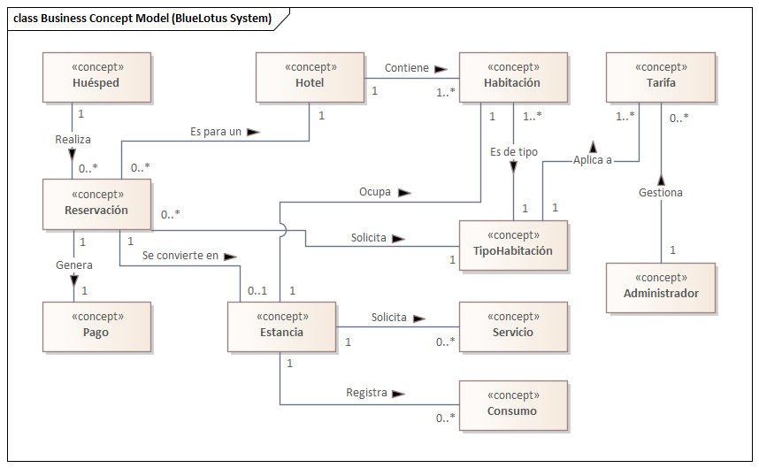

== Vista lógica

=== Propósito de la vista
El propósito de la Vista Lógica es presentar la estructura estática del BlueLotus System, así como el modelo de conceptos de negocio y un modelo de relaciones de actores. Esta vista se descompone en los componentes lógicos, en los cuales, se describen sus responsabilidades individuales y sus relaciones, sin entrar en detalles de implementación física o despliegue.

Esta vista facilita la comunicación entre arquitectos, desarrolladores y líderes, debido a que ofrece un lenguaje común del sistema.
Para los desarrolladores, esta vista sirve como una guía fundamental, mostrando la organización del sistema y cómo encaja cada elemento de funcionalidad.

Además, facilita establecer y demostrar cómo el sistema responderá a los principales atributos de calidad, en este caso, la modificabilidad, usabilidad, rendimiento, seguridad y escalabilidad.

=== Justificación de las decisiones

**Adopción de arquitectura cliente-servidor:**

_Drivers:_
Modificabilidad y mantenibilidad: La preocupación principal es facilitar la evolución del sistema a largo plazo (CRN-05).
Separación de responsabilidades: Una restricción clave que exige un desacoplamiento estricto entre la interfaz y la lógica de negocio (CON-12).

_Tácticas:_
Aplicación de táctica "Separar responsabilidades". El objetivo es aislar por completo la lógica de la interfaz de usuario (lo que ven e interactúan los usuarios) de la lógica de negocio y el almacenamiento de datos (reglas e información del sistema).

_Patrón/Decisión:_
Cliente-Servidor. Este patrón divide el sistema en dos componentes lógicos distintos que se comunican a través de una red-
  Cliente (front-end): Única responsabilidad es la presentación de información y captura de interacciones del usuario.
  Servidor (back-end): Actúa como el cerebro del sistema, centralizando toda la lógica de negocio, validaciones, procesamiento y acceso a base de datos.

Permite que equipos de desarrollo trabajen en paralelo y la tecnología de una parte pueda cambiar sin afectar la otra

_Trade-offs:_
Latencia de red: Cada operación requiere una comunicación a través de la red, lo que introduce una latencia que deberá ser gestionada para no afectar el rendimiento (QAS-07).
Dependencia a la red: Fiabilidad al sistema ahora depende de el cliente, el servidor y la red. Una falla en la conexión inutilizará la aplicación.

**Cliente de tipo Single-Page Application (SPA):**

_Drivers:_
Usabilidad: Necesidad de una de experiencia de usuario fluida, rápida y sin interrupciones. (QAS-04)
Rendimiento: Preocupación por una experiencia fluida que exige evitar recargas de página completas que interrumpen el flujo de trabajo del usuario. (QAS-06)

_Tácticas:_
Aplicación de táctica "Mantener un Modelo de Datos" en el lado del cliente. Implica que el cliente mantiene una copia local del estado de la aplicación, permitiendo actualizar la interfaz de usuario de forma instantánea en respuesta a las acciones que introduzca el usuario, para después sincronizar los cambios con el servidor.

_Patrón/Diseño:_
Single-Page Application (SPA). Carga una única página HTML, luego, con JavaScript, actualiza dinámicamente el contenido con el que el usuario interactúa. Crea experiencia de usuario similar a la de una aplicación de escritorio, siendo esencial para cumplir con escenarios de usabilidad.

_Trade-offs:_
Carga inicial lenta: La primera vez que el usuario accede, el navegador debe descargar el código de la aplicación, resultando en un tiempo de carga inicial más largo.
Complejidad del estado: La gestión del estado de la aplicación en el cliente se vuelve más compleha y propensa a errores.

**Uso de API RESTful:**

_Drivers:_
Interoperabilidad: Necesidad de que múltiples clientes (web, móvil) se comuniquen en el mismo servidor. (CON-11)
Modificabilidad: Restricción que el cliente u servidor sean completamente independientes. (CON-12)
Escalabilidad: Interfaz sin estado es más fácil de escalar horizonalmente. (QAS-10)

_Tácticas:_
Aplicación de tácticas "Adherirse a Estándares" y "Usar Intermediario". Al basarse en HTTP, se garantiza la compatibilidad, ya que es universal en la web.

_Patrón/Diseño:_
API RESTful.
  Comunicación sin estado: Cada petición del cliente contiene toda la información que el servidor necesita para procesarla.
  Interfaz uniforme: Usa verbos estándar de HTTP para operaciones.
  Formato de datos estándar: Uso de JSON ya que es fácil de procesar por los lenguajes de programación.

_Trade-offs:_
Over/Under-fetching: Cliente recibe más datos de los que necesita o tiene que hacer múltiples peticiones para obtener toda la información que requiere.
Deficiencias en tiempo real: No es eficiente para notificaciones en tiempo real del servidor.

**Estructura de servidor en capas:**

_Drivers:_
Modificabilidad: Necesidad de organizar el código para que un cambio en una parte no afecte a las otras. (CRN-05)
Mantenibilidad: Facilita la comprensión del sistema y la corrección de errores al tener responsabilidades bien definidas. (CON-08)

_Tácticas:_
Se aplican las tácticas "Encapsular" y "Separar Responsabilidades" dentro del propio servidor. La idea es crear barreras lógicas entre los diferentes tipos de tareas que realiza el back-end.

_Patrón/Diseño:_
Arquitectura en Capas. El servidor se divide internamente en capas con trabajos muy específicos, y una capa solo puede hablar con la capa que tiene justo debajo.
Capa de Presentación (API): Es la puerta de entrada. Su único trabajo es recibir las peticiones del cliente y enviar las respuestas. No sabe nada de lógica de negocio.
Capa de Negocio (Lógica): Es el cerebro y el corazón del sistema. Aquí viven todas las reglas, cálculos y flujos de trabajo
Capa de Acceso a Datos: Es la única que tiene permiso para hablar con la base de datos. Su trabajo es guardar y recuperar información.

_Trade-offs:_
Sobrecarga de rendimiento: Cada solicitud debe "saltar" de una capa a otra, lo que puede añadir una pequeña pero medible latencia al tiempo de respuesta total.
Más código para cambios simples: A veces, para añadir un simple campo a una pantalla, es necesario modificar archivos en todas las capas, lo que puede sentirse repetitivo o lento.

**Centralizar lógica en Service Layer:**

_Drivers:_
Cohesión y Reutilización: Se busca evitar la duplicación de código de negocio. Si la lógica para cancelar una reserva está en un solo lugar, nos aseguramos de que siempre se ejecute de la misma manera, sin importar desde dónde se llame (web, móvil). (CRN-10)
Mantenibilidad: Facilita enormemente la modificación de una regla de negocio. Si la política de cancelación cambia, solo hay que modificar un único lugar en el código. (CRN-05)

_Tácticas:_
Aplicación de la táctica "Encapsular" para agrupar todas las operaciones y pasos relacionados con una entidad de negocio en componentes cohesivos y reutilizables.

_Patrón/Diseño:_
Service Layer (Capa de Servicios). Este patrón actúa como un coordinador para la lógica de negocio. La capa de API no realiza el trabajo directamente, en su lugar, le pide a un servicio que realice una acción. Este servicio es el que orquesta todo lo necesario: valida los datos, se comunica con la capa de acceso a datos para guardar o leer información.

_Trade-offs:_
Capa extra para operaciones simples: Para funcionalidades muy básicas puede parecer una capa innecesaria que solo añade un paso más.
Riesgo de servicios gigantes: Si no se diseña con cuidado, un único servicio puede empezar a acumular demasiadas responsabilidades, volviéndose grande y difícil de mantener.

**Aislamiento de seguridad y auditoría:**

_Drivers:_
Seguridad: Necesidad de aplicar reglas de autenticación (quién inetnta acceder) y autorización (qué puede hacer) de manera consistente y obligatoria en todo el sistema. (QAS-14) (CRN-03)
Trazabilidad: Requisito legal y de negocio de registrar todas las operaciones críticas (quién hizo qué y cuándo) para futuras auditorías o para detectar problemas. (CON-10)

_Tácticas:_
Aplicación de las tácticas "Autenticar Usuarios", "Limitar Acceso" y "Auditar", centralizando su lógica para garantizar que se apliquen de manera uniforme a cada uno de ellos.

_Patrón/Decisión:_
Módulos Transversales (Cross-Cutting Concerns). La seguridad y la auditoría no son parte de una única funcionalidad, sino que atraviesan todo el sistema. Se crean módulos específicos que interceptan las peticiones. Eston son el Módulo de Seguridad que verifica los permisos (usando OAuth 2.0 y MFA) antes de que la petición llegue a la lógica de negocio. Y el Módulo de Auditoría, que registra la acción una vez que se ha completado, permitiendo que la lógica de negocio se enfoque solo en su trabajo, sin preocuparse por la seguridad o el registro.

_Trade-offs:_
Impacto global de fallos: Un error en el módulo de seguridad puede bloquear el acceso a toda la aplicación, incluso si las demás partes funcionan bien.
Dificultad en la trazabilidad del flujo: La lógica se ejecuta de forma implícita (en segundo plano), lo que puede hacer que el flujo completo de una petición sea más difícil de seguir y depurar para un nuevo desarrollador.

**Acceso a datos con el patrón DAO/ORM:**

_Drivers:_
Modificabilidad: Se busca abstraer la tecnología de la base de datos. Esto facilita un posible cambio en el futuro sin tener que reescribir toda la lógica de negocio de la aplicación. (CON-01)
Mantenibilidad: El código de negocio se mantiene limpio de sentencias SQL, lo que lo hace mucho más legible, fácil de probar y menos propenso a errores de inyección SQL.

_Tácticas:_
Se aplica la táctica de "Encapsular" para ocultar todos los detalles complejos de la comunicación con la base de datos (conexiones, sentencias SQL, transacciones).

_Patrón/Diseño:_
DAO (Data Access Object) / ORM (Object-Relational Mapping). Permite al código de la aplicación trabajar con objetos simples, mientras que el ORM se encarga de convertir esos objetos en sentencias SQL para la base de datos y viceversa.

_Trade-offs:_
Consultas ineficientes: A veces, el traductor automático puede generar código SQL poco optimizado, lo que puede afectar el rendimiento en consultas complejas si no se supervisa.

**Uso de dockers/kubernetes:**

_Drivers:_
Escalabilidad: Impulsado por los escenarios de escalabilidad (QAS-10) horizontal y elasticidad (QAS-12), así como la preocupación general por el crecimiento. (CRN-04)
Disponibilidad: Crítico para cumplir con los escenarios de manejo de picos de tráfico (QAS-02), recuperación automática (QAS-03) y restricción de alta disponibilidad del 95% (CON-05).

_Tácticas:_
Aplicación de tácticas Introducir redundancia (ejecutar múltiples copias de cada servicio), Balancear carga (distribuir el tráfico entre las copias) y Recuperación Automática (reemplazar automáticamente los componentes que fallan).

_Patrón/Diseño:_
Docker: Empaqueta cada servicio en un contenedor, una unidad ligera y portable que incluye su código y todas sus dependencias. Garantiza que se ejecute de manera idéntica en cualquier entorno.
Kubernetes: Gestiona estos contenedores para la escalabilidad y el aumento o disminucióm automática del número de contenedores según la demanda. Para la disponibilidad, monitorea la salud de los contenedores y si uno falla lo reemplaza al instante.

_Trade-offs:_
Complejidad operativa: La gestión de un clúster de Kubernetes es extremadamente compleja y requiere un alto nivel de conocimiento especializado en infraestructura, redes y seguridad
Curva de aprendizaje alta: El equipo de desarrollo debe capacitarse en un ecosistema de herramientas completamente nuevo.
Costo de recursos: La sobrecarga de recursos puede incrementar los costos de infraestructura, especialmente para aplicaciones pequeñas.

=== Estructura estática del sistema

La vista lógica describe la estructura estática del BlueLotus System, descomponiendo el software en sus principales componentes lógicos y sus responsabilidades. El diagrama ilustra cómo la arquitectura final es el resultado directo del proceso iterativo **Attribute-Driven Design (ADD)**, garantizando que cada componente y capa responde de manera trazable a los impulsores críticos del sistema. A continuación, se presenta el diagrama de la estructura estática del sistema:

image::../images/ArchitectureStyleModel.png[Estructura Estática del Sistema, width=600, align="center"]

La arquitectura del sistema es un modelo híbrido que se define como: una **arquitectura Cliente-Servidor basada en una Aplicación de Internet Rica (RIA) y una API RESTful, con una organización interna en el servidor por capas y orientadas a componentes.** Esta estructura equilibra los atributos de calidad priorizados, como la modificabilidad, usabilidad, rendimiento, seguridad y escalabilidad.

La justificación de la estructura se describe recorriendo sus elementos principales, conectándolos con las decisiones tomadas durante el proceso de diseño arquitectónico.

==== Arquitectura general Cliente-Servidor

La decisión fundamental, tomada durante la **Iteración 1** para satisfacer los drivers de mantenibilidad y separación de responsabilidades, fue adoptar el estilo Cliente-Servidor. Esta elección es la táctica principal que permite que las interfaces de usuario (front-end) y la lógica de negocio (back-end) evolucionen de manera independiente, atacando directamente el objetivo de dicha iteración a través de una comunicación bien definida por una API RESTful.

==== Capa de Cliente

A su vez, en la capa de cliente, la arquitectura responde directamente al driver de usabilidad, un objetivo clave de la **Iteración 4**. Para lograr una experiencia de usuario fluida y dinámica, se decidió implementar la capa de presentación como una **Single-Page Application (SPA)**. Este tipo de RIA, utilizando tecnologías como React, carga el esqueleto de la aplicación una sola vez y luego actualiza dinámicamente el contenido, proporcionando una experiencia más rápida y receptiva en comparación con las aplicaciones web tradicionales.

==== Capa de Servidor

Internamente, el servidor revela una **organización en capas** diseñada para maximizar la separación de responsabilidades, conforme al objetivo de la **Iteración 1**. La capa más externa corresponde a los **Controladores REST**, que actúan como la fachada segura del servidor. Aquí se aplican tácticas de rendimiento de la **Iteración 2**, como mantener sesiones ligeras, y se delega la verificación de identidad al Módulo de Autenticación y Seguridad, cumpliendo con los drivers de seguridad definidos en la **Iteración 3**.

El núcleo del sistema reside en la capa de **Lógica de Negocio**. Lejos de ser un bloque monolítico, consiste en los **Servicios de Negocio (Reservaciones, Pagos, etc.)**, que encapsulan las reglas principales. Para optimizar el rendimiento y la disponibilidad, objetivos de la **Iteración 2**, se introdujo el patrón **Service Layer** y se planificaron esquemas de caché. Este núcleo funcional es soportado por dos módulos transversales que fueron resultado de la **Iteración 3**: el Módulo de Autenticación y Seguridad, que centraliza la lógica de permisos del sistema con OAuth 2.0 y MFA, y el Módulo de Auditoría y Registro, que proporciona trazabilidad y monitoreo continuo de las operaciones críticas.

==== Capa de Acceso a Datos

En cuanto a la última capa, la capa de Acceso a Datos, a través del **patrón DAO/ORM**, abstrae la comunicación con la base de datos, una decisión de la **Iteración 1** que garantiza la mantenibilidad y el cumplimiento de la restricción de usar un RDBMS relacional. Esta capa también incorpora tácticas de rendimiento, como la optimización de consultas y el uso de índices, para asegurar que las operaciones de lectura y escritura sean eficientes.

==== Soporte a Escalabilidad y Disponibilidad

Por último, la estructura completa está diseñada para soportar los atributos de escalabilidad y disponibilidad. La alta disponibilidad, objetivo de la **Iteración 2**, se aborda con un diseño que permite el uso de balanceadores de carga y mecanismos de failover. La escalabilidad, driver principal de la **Iteración 4**, se logra mediante una arquitectura preparada para ser desplegada en contenedores Docker orquestados por Kubernetes, lo que habilita un escalado automático y elástico según la demanda.

=== Modelo de Conceptos del Negocio

El **Modelo de Conceptos del Negocio (BCM)** describe los conceptos clave y las relaciones en el dominio del negocio. Proporciona una comprensión común de los términos y definiciones utilizados en la organización.
A continuación, se presenta el modelo de conceptos del negocio para este proyecto, representado mediante un diagrama de clases UML:

==== Diagrama del Modelo de Conceptos del Negocio

==== Verificación de Creación, Modificación y Eliminación de Conceptos

[cols="^25, <75", options="header"]
|===
| Entidad | Verificación de creación, modificación y eliminación
| Hotel | Se requieren casos de uso para agregar, modificar y dar de baja hoteles desde el backoffice.
| Habitación | Se requieren casos de uso para gestionar el inventario: agregar, modificación de estado o dar de baja habitaciones.
| TipoHabitación | Se requieren casos de uso para crear nuevos tipos de habitación, modificarlos o eliminarlos.
| Tarifa | Se necesita un caso de uso específico para la creación y modificación diaria de tarifas.
| Reservación | Se necesita un caso de uso para su creación y otro para su cancelación (eliminación lógica).
| Estancia | Se crea durante el check-in, se finaliza en el check-out y se modifica si hay un cambio de habitación.
| Consumo | Se necesita un caso de uso para registrar consumos y, opcionalmente, para modificarlos o eliminarlos en caso de error.
| Pago | Se crea al reservar. Su estado puede cambiar, lo que implica una gestión, pero no se modifica ni elimina el registro original.
| Usuario | Se requieren casos de uso para la administración completa de todos los roles de usuario.
|===

==== Verificación de Actualización de Asociaciones

[cols="^35, <65", options="header"]
|===
| Relaciones | Estado
| Huésped - Reservación | Nunca cambia.
| Reservación - Hotel | Nunca cambia.
| Reservación - TipoHabitación | Podría cambiar si se implementa una modificación de la reservación.
| Reservación - Pago | Nunca cambia.
| Reservación - Estancia | Se establece una vez en el check-in y no cambia.
| Estancia - Habitación | Puede cambiar, ya que la funcionalidad de "cambio de habitación" está contemplada.
| Estancia - Consumo | Es dinámica; se agregan consumos a lo largo de la estancia.
| Estancia - Servicio | Es dinámica; se agregan servicios a lo largo de la estancia.
| Hotel - Habitación | Nunca cambia.
| Habitación - TipoHabitación | Nunca cambia.
| Administrador - Tarifa | Es dinámica, un administrador puede actualizar diferentes tarifas según sea necesario.
| Tarifa - TipoHabitación | Puede cambiar, ya que "los administradores podrán cambiar tarifas diarias".
|===

==== Modelo de Relaciones de Actores

image::../images/ActorRelationshipsModel.png[Modelo de Relaciones de Actores, width=600, align="center"]
