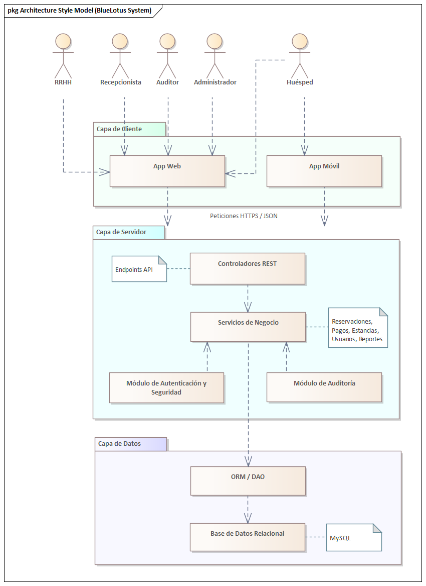

== Vista lógica

=== Propósito de la vista
El propósito de la Vista Lógica es presentar la estructura estática del BlueLotus System, así como el modelo de conceptos de negocio y un modelo de relaciones de actores. Esta vista se descompone en los componentes lógicos, en los cuales, se describen sus responsabilidades individuales y sus relaciones, sin entrar en detalles de implementación física o despliegue.

Esta vista facilita la comunicación entre arquitectos, desarrolladores y líderes, debido a que ofrece un lenguaje común del sistema.
Para los desarrolladores, esta vista sirve como una guía fundamental, mostrando la organización del sistema y cómo encaja cada elemento de funcionalidad.

Además, facilita establecer y demostrar cómo el sistema responderá a los principales atributos de calidad, en este caso, la modificabilidad, usabilidad, rendimiento, seguridad y escalabilidad.

=== Justificación de las decisiones

**Adopción de arquitectura cliente-servidor:** Se eligió para separar las responsabilidades en todo el sistema. Permite que el desarrollo del front-end (cliente) y el de back-end (servidor) trabajen y evolucionen de forma independiente, maximizando la modificabilidad y facilitando el mantenimiento a largo plazo.

**Cliente de tipo Single-Page Application (SPA):** Al cargar la aplicación una sola vez y actualizar el contenido dinámicamente, ofrece una experiencia de usuario más rápida y fluida, mejorando el rendimiento percibido por el usuario.

**Estructura de servidor en capas:** Promueve la separación de responsabilidades y la modificabilidad, donde cada capa tiene un propósito claro, lo que simplifica el desarrollo y mantenimiento.

**Uso de API RESTful:** Proporciona una interfaz estándar entre cliente y el ervsidor con el fin de apoyar la interoperabilidad y la separación entre la capa de presentación y la lógica de negocio.

**Acceso a datos con el patrón DAO/ORM:** Ofrece la capacidad de desacoplar la lógica de negocio con la tecnología de bases de datos usada, facilitando migraciones y protegiendo al sistema de cambios, desembocando en una satisfacción de la mantenibilidad.

**Uso de dockers/kubernetes:** Esta estrategia satisface los atributos de escalabilidad y disponibilidad. Permite que la aplicación se empaquete en contenedores Docker, creando módulos portables y consistentes. Para su gestión de forma automatizada y replicarlos en momentos de alta demanda, se usarán Kubernetes.

=== Estructura estática del sistema

La vista lógica describe la estructura estática del BlueLotus System, descomponiendo el software en sus principales componentes lógicos y sus responsabilidades. El diagrama ilustra cómo la arquitectura final es el resultado directo del proceso iterativo **Attribute-Driven Design (ADD)**, garantizando que cada componente y capa responde de manera trazable a los impulsores críticos del sistema. A continuación, se presenta el diagrama de la estructura estática del sistema:

La arquitectura del sistema es un modelo híbrido que se define como: una **arquitectura Cliente-Servidor basada en una Aplicación de Internet Rica (RIA) y una API RESTful, con una organización interna en el servidor por capas y orientadas a componentes.** Esta estructura equilibra los atributos de calidad priorizados, como la modificabilidad, usabilidad, rendimiento, seguridad y escalabilidad.

La justificación de la estructura se describe recorriendo sus elementos principales, conectándolos con las decisiones tomadas durante el proceso de diseño arquitectónico.

==== Arquitectura general Cliente-Servidor

La decisión fundamental, tomada durante la **Iteración 1** para satisfacer los drivers de mantenibilidad y separación de responsabilidades, fue adoptar el estilo Cliente-Servidor. Esta elección es la táctica principal que permite que las interfaces de usuario (front-end) y la lógica de negocio (back-end) evolucionen de manera independiente, atacando directamente el objetivo de dicha iteración a través de una comunicación bien definida por una API RESTful.

==== Capa de Cliente

A su vez, en la capa de cliente, la arquitectura responde directamente al driver de usabilidad, un objetivo clave de la **Iteración 4**. Para lograr una experiencia de usuario fluida y dinámica, se decidió implementar la capa de presentación como una **Single-Page Application (SPA)**. Este tipo de RIA, utilizando tecnologías como React, carga el esqueleto de la aplicación una sola vez y luego actualiza dinámicamente el contenido, proporcionando una experiencia más rápida y receptiva en comparación con las aplicaciones web tradicionales.

==== Capa de Servidor

Internamente, el servidor revela una **organización en capas** diseñada para maximizar la separación de responsabilidades, conforme al objetivo de la **Iteración 1**. La capa más externa corresponde a los **Controladores REST**, que actúan como la fachada segura del servidor. Aquí se aplican tácticas de rendimiento de la **Iteración 2**, como mantener sesiones ligeras, y se delega la verificación de identidad al Módulo de Autenticación y Seguridad, cumpliendo con los drivers de seguridad definidos en la **Iteración 3**.

El núcleo del sistema reside en la capa de **Lógica de Negocio**. Lejos de ser un bloque monolítico, consiste en los **Servicios de Negocio (Reservaciones, Pagos, etc.)**, que encapsulan las reglas principales. Para optimizar el rendimiento y la disponibilidad, objetivos de la **Iteración 2**, se introdujo el patrón **Service Layer** y se planificaron esquemas de caché. Este núcleo funcional es soportado por dos módulos transversales que fueron resultado de la **Iteración 3**: el Módulo de Autenticación y Seguridad, que centraliza la lógica de permisos del sistema con OAuth 2.0 y MFA, y el Módulo de Auditoría y Registro, que proporciona trazabilidad y monitoreo continuo de las operaciones críticas.

==== Capa de Acceso a Datos

En cuanto a la última capa, la capa de Acceso a Datos, a través del **patrón DAO/ORM**, abstrae la comunicación con la base de datos, una decisión de la **Iteración 1** que garantiza la mantenibilidad y el cumplimiento de la restricción de usar un RDBMS relacional. Esta capa también incorpora tácticas de rendimiento, como la optimización de consultas y el uso de índices, para asegurar que las operaciones de lectura y escritura sean eficientes.

==== Soporte a Escalabilidad y Disponibilidad

Por último, la estructura completa está diseñada para soportar los atributos de escalabilidad y disponibilidad. La alta disponibilidad, objetivo de la **Iteración 2**, se aborda con un diseño que permite el uso de balanceadores de carga y mecanismos de failover. La escalabilidad, driver principal de la **Iteración 4**, se logra mediante una arquitectura preparada para ser desplegada en contenedores Docker orquestados por Kubernetes, lo que habilita un escalado automático y elástico según la demanda.

=== Modelo de Conceptos del Negocio

El **Modelo de Conceptos del Negocio (BCM)** describe los conceptos clave y las relaciones en el dominio del negocio. Proporciona una comprensión común de los términos y definiciones utilizados en la organización.
A continuación, se presenta el modelo de conceptos del negocio para este proyecto, representado mediante un diagrama de clases UML:

==== Diagrama del Modelo de Conceptos del Negocio

image::../images/BusinessConceptModel.png[Modelo de Conceptos del Negocio, width=600, align="center"]

==== Verificación de Creación, Modificación y Eliminación de Conceptos

[cols="^25, <75", options="header"]
|===
| Entidad | Verificación de creación, modificación y eliminación
| Hotel | Se requieren casos de uso para agregar, modificar y dar de baja hoteles desde el backoffice.
| Habitación | Se requieren casos de uso para gestionar el inventario: agregar, modificación de estado o dar de baja habitaciones.
| TipoHabitación | Se requieren casos de uso para crear nuevos tipos de habitación, modificarlos o eliminarlos.
| Tarifa | Se necesita un caso de uso específico para la creación y modificación diaria de tarifas.
| Reservación | Se necesita un caso de uso para su creación y otro para su cancelación (eliminación lógica).
| Estancia | Se crea durante el check-in, se finaliza en el check-out y se modifica si hay un cambio de habitación.
| Consumo | Se necesita un caso de uso para registrar consumos y, opcionalmente, para modificarlos o eliminarlos en caso de error.
| Pago | Se crea al reservar. Su estado puede cambiar, lo que implica una gestión, pero no se modifica ni elimina el registro original.
| Usuario | Se requieren casos de uso para la administración completa de todos los roles de usuario.
|===

==== Verificación de Actualización de Asociaciones

[cols="^35, <65", options="header"]
|===
| Relaciones | Estado
| Huésped - Reservación | Nunca cambia.
| Reservación - Hotel | Nunca cambia.
| Reservación - TipoHabitación | Podría cambiar si se implementa una modificación de la reservación.
| Reservación - Pago | Nunca cambia.
| Reservación - Estancia | Se establece una vez en el check-in y no cambia.
| Estancia - Habitación | Puede cambiar, ya que la funcionalidad de "cambio de habitación" está contemplada.
| Estancia - Consumo | Es dinámica; se agregan consumos a lo largo de la estancia.
| Estancia - Servicio | Es dinámica; se agregan servicios a lo largo de la estancia.
| Hotel - Habitación | Nunca cambia.
| Habitación - TipoHabitación | Nunca cambia.
| Administrador - Tarifa | Es dinámica, un administrador puede actualizar diferentes tarifas según sea necesario.
| Tarifa - TipoHabitación | Puede cambiar, ya que "los administradores podrán cambiar tarifas diarias".
|===

==== Modelo de Relaciones de Actores

