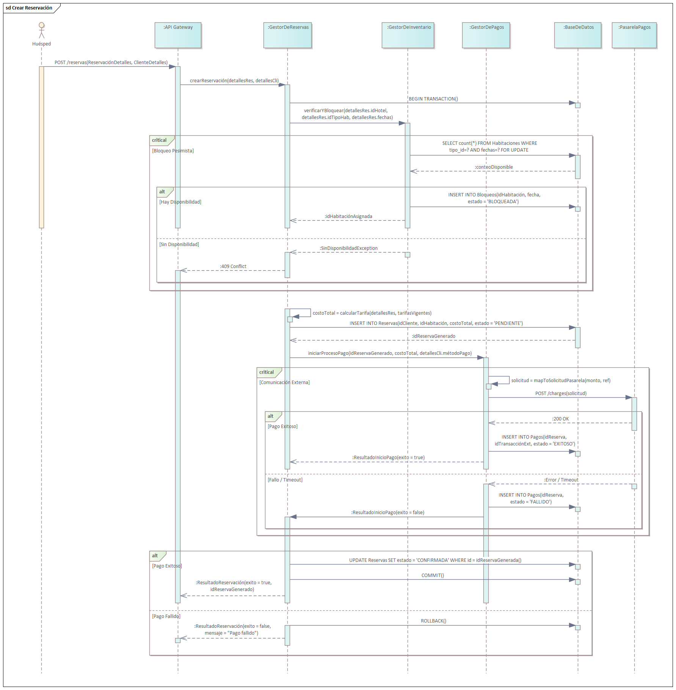
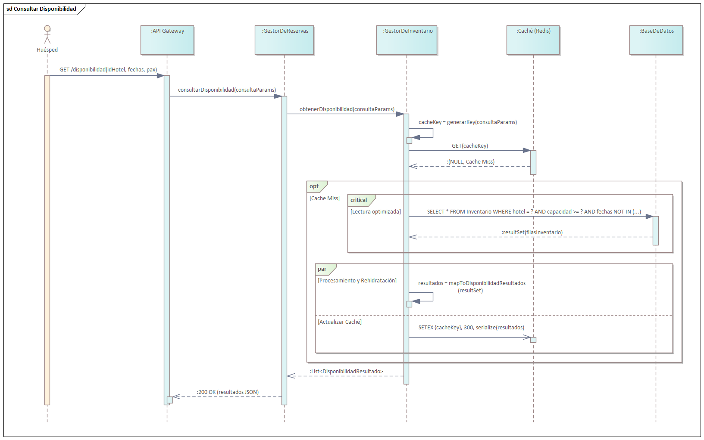
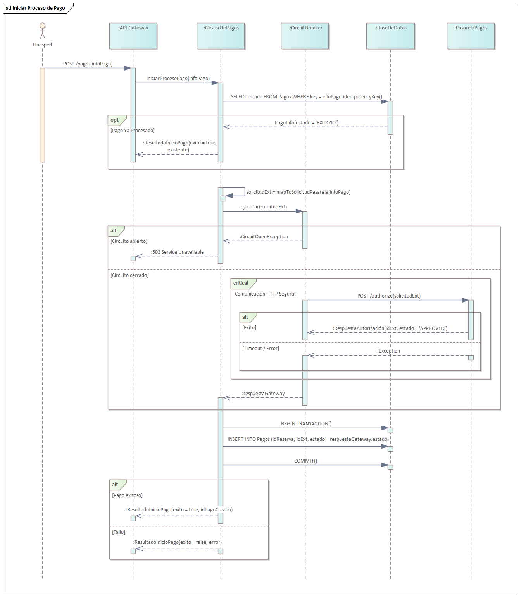

== Vista de proceso

=== Propósito de la vista

La vista de proceso del BlueLotus System tiene como objetivo describir los aspectos dinámicos de la arquitectura, enfocándose en cómo el sistema se comporta en tiempo de ejecución. Mientras que las vistas anteriores definen la estructura estática de componentes e interfaces, esta vista explica cómo esos elementos interactúan para soportar la concurrencia, la distribución, la integridad de los datos y la tolerancia a fallos.

Esta vista busca representar los flujos de control y de datos a través de los procesos críticos del negocio, detallando cómo se manejan los hilos de ejecución, la sincronización entre procesos y la gestión de transacciones. Es fundamental para entender cómo el sistema garantiza los atributos de calidad relacionados con el rendimiento (latencia y throughput) y la fiabilidad (disponibilidad y resiliencia) bajo condiciones de carga real.

Se espera que esta vista sirva como guía técnica para comprender los mecanismos de orquestación complejos, el manejo de estados transaccionales y las estrategias de integración con sistemas externos. Al detallar estos procesos, se busca asegurar que los desarrolladores implementen correctamente los patrones de concurrencia y recuperación ante errores, evitando condiciones de carrera, bloqueos o inconsistencias en la información crítica del hotel.

La vista de proceso conecta la lógica de negocio con la realidad operativa de un entorno distribuido, proporcionando las pautas necesarias para garantizar que el BlueLotus System sea robusto, consistente y performante.

=== Justificación de las decisiones

En la vista de proceso se tomaron decisiones arquitectónicas orientadas a resolver los desafíos inherentes a un sistema de alta concurrencia y disponibilidad global. Las decisiones técnicas aquí documentadas reflejan cómo se equilibran la integridad estricta de los datos financieros y de inventario con la necesidad de una experiencia de usuario ágil y responsiva.

Todo lo modelado en esta etapa se basa en los escenarios críticos identificados en los atributos de calidad, transformando los requisitos abstractos de rendimiento y seguridad en flujos de ejecución concretos y patrones de diseño aplicables.

**Drivers**

Las decisiones tomadas para los procesos del sistema estuvieron impulsadas por requisitos no funcionales críticos y restricciones de negocio.

Uno de los impulsores más fuertes fue la **Integridad de Datos y Consistencia (CRN-10)**. En el dominio hotelero, el riesgo de overbooking accidental (vender la misma habitación a dos clientes simultáneamente) es inaceptable desde una perspectiva operativa y de reputación. El sistema debía garantizar que las transacciones de reserva fueran atómicas y aisladas, asegurando que no existan reservas confirmadas sin un pago exitoso asociado.

El **Rendimiento y Escalabilidad (QAS-07, QAS-08)** fueron determinantes para los procesos de lectura. Dado que la consulta de disponibilidad es la operación más frecuente (300 QPS) y sensible a la latencia (<500ms), era inviable depender exclusivamente de transacciones directas a la base de datos maestra para cada consulta de usuario, lo que impulsó la necesidad de estrategias de optimización de lectura.

La **Resiliencia y Disponibilidad (QAS-01, CON-06)** guiaron el diseño de los procesos que dependen de terceros. La integración con la pasarela de pagos externa introduce un punto de fallo fuera del control del sistema. Era imperativo que el sistema pudiera detectar fallos externos, protegerse de la saturación de recursos (hilos colgados) y fallar de manera rápida y controlada para no afectar otras operaciones internas.

Finalmente, la **Experiencia de Usuario (CRN-02)** impulsó la decisión de minimizar los tiempos de espera perceptibles, promoviendo el uso de procesamiento asíncrono para tareas que no requieren confirmación inmediata al usuario, como la actualización de cachés o registros secundarios.

**Tácticas**

Para atender estos impulsores, se aplicaron tácticas específicas de diseño de sistemas distribuidos y concurrentes.

Se aplicó la táctica de **Manejo de Concurrencia** mediante el uso de bloqueos pesimistas (*Pessimistic Locking*) para los recursos críticos. En lugar de permitir que múltiples procesos intenten modificar el inventario al mismo tiempo y resolver conflictos al final, se optó por serializar el acceso a nivel de base de datos para la entidad de habitación durante el proceso de reserva. Esto garantiza la consistencia fuerte necesaria para evitar la sobreventa.

Para el rendimiento, se utilizó la táctica de **Introducir Caché** (*Caching*). Se decidió almacenar los datos de disponibilidad frecuentemente consultados en una memoria intermedia de acceso rápido, reduciendo drásticamente la carga sobre la base de datos principal y mejorando los tiempos de respuesta para el usuario final.

La táctica de **Separación de Lectura y Escritura** (*Read/Write Separation*) se empleó para escalar la capacidad de procesamiento. Los flujos transaccionales (escritura) se dirigen a nodos maestros que garantizan consistencia, mientras que los flujos de consulta masiva (lectura) se dirigen a réplicas, permitiendo que el sistema maneje altos volúmenes de tráfico sin degradar el rendimiento de las operaciones críticas.

Para la resiliencia, se aplicaron tácticas de **Detección de Fallos y Recuperación**, incluyendo el uso de *Timeouts* agresivos para liberar recursos rápidamente cuando los servicios externos no responden, y la implementación de *Fail-Fast* para evitar la propagación de errores en cadena.

**Patrones y Decisiones**

Estas tácticas se materializaron mediante la implementación de patrones de diseño robustos en los diagramas de secuencia.

Para la creación de reservaciones, se decidió utilizar un patrón de **Transacción ACID Local** orquestada por el `GestorDeReservas`. Se optó por mantener la lógica de bloqueo de inventario, creación de reserva y confirmación de pago dentro de un mismo contexto transaccional de base de datos siempre que fuera posible, apoyado por sentencias `SELECT ... FOR UPDATE` para el bloqueo de filas. Esto simplifica el manejo de la consistencia en comparación con transacciones distribuidas complejas (como Sagas) en esta etapa del diseño.

Para las consultas de disponibilidad, se implementó el patrón **Cache-Aside**. El sistema verifica primero la caché distribuida (Redis); si el dato no existe (*cache miss*), consulta a la base de datos y actualiza la caché. Se tomó la decisión explícita de realizar la actualización de la caché ("rehidratación") de manera asíncrona (*Fire-and-Forget*) para no bloquear la respuesta al usuario, priorizando la latencia sobre la consistencia inmediata de la caché.

Para la integración con pagos, se aplicó el patrón **Circuit Breaker**. Este patrón envuelve las llamadas a la pasarela externa; si se detectan fallos consecutivos o tiempos de espera, el circuito se abre y rechaza inmediatamente nuevas peticiones sin intentar conectar. Esto protege al sistema de agotamiento de hilos. Además, se implementó el patrón de **Idempotencia** verificando claves únicas antes de procesar cobros, garantizando que reintentos de red no generen cargos duplicados.

**Trade-offs**

Las decisiones tomadas en esta vista conllevan compromisos técnicos necesarios para cumplir con los objetivos del negocio.

El uso de **bloqueo pesimista** en la base de datos garantiza la integridad del inventario, pero introduce un *trade-off* en la escalabilidad de escritura. Bajo una carga extremadamente alta de reservas simultáneas para la misma habitación, los hilos de ejecución podrían encolarse esperando el bloqueo, reduciendo el throughput del sistema. Se considera un costo aceptable dado que la integridad financiera y del inventario es prioritaria sobre la velocidad pura en este flujo específico.

La implementación del patrón **Cache-Aside y Réplicas de Lectura** introduce el riesgo de **consistencia eventual**. Existe una pequeña ventana de tiempo en la que un usuario podría ver disponibilidad en una búsqueda (leída de una réplica o caché desactualizada) que ya no existe en el maestro. Este *trade-off* se mitiga validando la disponibilidad real nuevamente en el momento de la escritura (crear reserva), priorizando así el rendimiento en la búsqueda.

La introducción de mecanismos de resiliencia como **Circuit Breaker e Idempotencia** aumenta la **complejidad del desarrollo y las pruebas**. Los desarrolladores deben gestionar estados intermedios y flujos de error más sofisticados. Sin embargo, este aumento en la complejidad de implementación se justifica por la estabilidad operativa que proporciona ante fallos de terceros, evitando caídas del sistema completo.

=== Diagramas de Secuencia

A continuación se detallan los flujos de proceso para los escenarios más críticos del sistema, seleccionados por su complejidad técnica y su impacto en los atributos de calidad de integridad, rendimiento y resiliencia.

==== Crear Reservación

Este flujo ilustra la orquestación de una transacción crítica de negocio diseñada para garantizar la integridad de los datos y evitar la sobreventa de inventario en un entorno de alta concurrencia. El proceso comienza con el `GestorDeReservas` iniciando una transacción ACID local que coordina la lógica de bloqueo, creación y confirmación. Para gestionar la concurrencia de manera segura, se aplica una estrategia de bloqueo pesimista (Pessimistic Locking) a nivel de base de datos durante la verificación del inventario, lo que impide físicamente que otros procesos intenten reservar la misma habitación simultáneamente hasta que la transacción actual finalice.

La interacción con la pasarela de pagos externa se realiza de manera síncrona para poder ofrecer una confirmación inmediata al usuario, pero se protege mediante un timeout estricto para evitar el bloqueo indefinido de los recursos del servidor. El diseño asegura la consistencia final del sistema mediante un mecanismo de compensación automático: en caso de que el pago falle o la comunicación externa exceda el tiempo límite, el sistema ejecuta un rollback completo de la transacción. Esta acción libera inmediatamente el bloqueo sobre el inventario y elimina el registro preliminar de la reserva, garantizando que nunca existan reservas confirmadas sin un pago válido asociado.

==== Consultar Disponibilidad

Este diagrama representa la estrategia de optimización de lectura diseñada para soportar una carga elevada de consultas por segundo manteniendo una latencia mínima. El flujo implementa el patrón Cache-Aside utilizando una caché distribuida como primera línea de defensa. Al recibir una consulta, el `GestorDeInventario` verifica primero la memoria caché utilizando una clave única generada a partir de los parámetros de búsqueda; si la información está disponible, se retorna casi instantáneamente, evitando por completo el acceso a la base de datos y liberando carga del sistema de persistencia.

En el escenario donde los datos no se encuentran en la caché, el sistema dirige la consulta hacia una réplica de lectura de la base de datos, una decisión arquitectónica que aísla el tráfico de consultas masivas del nodo maestro encargado de las transacciones de escritura críticas. Para maximizar la velocidad de respuesta percibida por el usuario, la actualización o "rehidratación" de la caché con los datos frescos obtenidos de la base de datos se realiza de manera asíncrona y paralela al procesamiento de la respuesta. Esto asegura que el usuario reciba la información lo antes posible sin tener que esperar a que finalicen las operaciones de escritura en la infraestructura de caché.

==== Iniciar Proceso de Pago

Este proceso detalla los mecanismos de robustez e integridad financiera implementados para gestionar la integración con la pasarela de pagos externa, un componente crítico fuera del control del sistema. El flujo inicia con la aplicación estricta del patrón de Idempotencia, donde el `GestorDePagos` consulta la base de datos para verificar si la clave única de la transacción ya ha sido procesada anteriormente. Esta validación previa previene eficazmente los cobros duplicados que podrían surgir por reintentos automáticos de la red o acciones repetidas del usuario en la interfaz.

Para proteger la disponibilidad del sistema ante posibles fallos o lentitud del proveedor externo, la comunicación se encapsula dentro de un patrón Circuit Breaker. Este mecanismo monitorea continuamente la salud de la integración y, ante una serie de fallos consecutivos o tiempos de espera agotados, abre el circuito para rechazar inmediatamente nuevas solicitudes de pago de forma local. Esta estrategia de fallo rápido (Fail-Fast) evita que los hilos de ejecución del servidor de aplicaciones se saturen esperando respuestas de un sistema externo caído, permitiendo que el resto de la aplicación continúe operando con normalidad. Finalmente, el estado resultante de la transacción se persiste localmente en una operación atómica para asegurar la trazabilidad completa del evento financiero.
